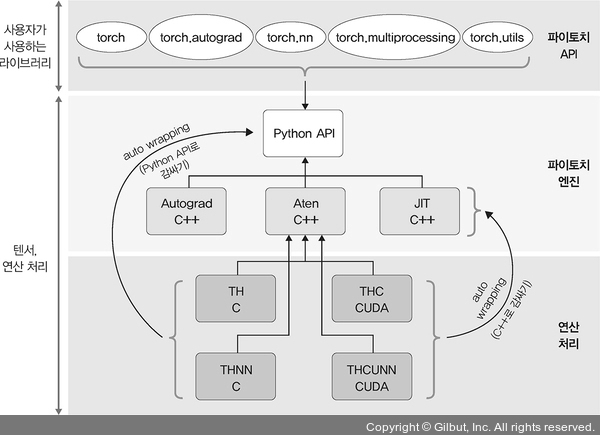
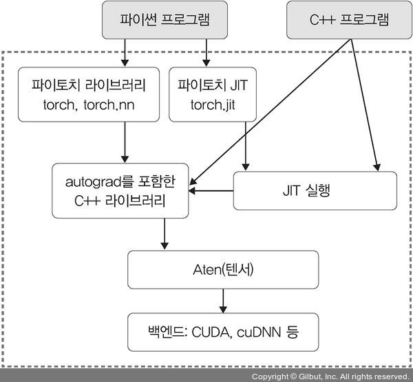

># 파이토치 *(Pytorch)*
>파이썬 연산 라이브러리
>
>### GPU, 텐서, 아키텍처
---

## GPU *(Graphics Processing Unit, 그래픽 처리 장치)* ★
연산 속도↑
```angular2html
예) CUDA, cuDNN
```

## 텐서 *(Tensor)*
Pytorch `다차원 배열` 데이터

## 아키텍처 *(architecture)*
###### 

+ ### API 
  사용자 인터페이스
  ```
  torch: 텐서 + GPU
  torch.autograd: 자동 미분
  torch.nn: 모델 생성＆설정＆학습
  torch.multiprocessing: 프로세스 공유
  torch.utils.data.DataLoader: 데이터 불러오기
  torch.onnx
  ```

+ ### 엔진
  ###### 
  ```
  Python API
  
  Autograd C++: 자동 미분
  Aten C++: 텐서 라이브러리
  JIT C++: 연산 최적화 컴파일러
  ```

+ ### 연산 
  ```
  TH C
  THNN C
  
  THC CUDA
  THCUNN CUDA
  ```
