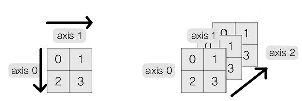

># 텐서 *(tensor)*
> 
>### 정보, 생성, 변경
###### 
```angular2html
ㅁ 1차원 텐서(벡터)
행: axis = 0

ㅁ 2차원 텐서(행렬)
열: axis = 1 

ㅁ 3차원 텐서
채널: axis = 2
```
---

```
v = torch.Tensor( [0, 1, 3, 4] )    # 1차원
m = torch.Tensor( [ [1,2,3], [4,5,6] ] )    # 2차원
```

## 정보

+ ### 크기 
  `변수.shape`, `변수.size()`
  ```
  v.shape    # torch.Size([4])
  v.size()    # torch.Size([4])
  
  m.shape    # torch.Size([2, 3])
  m.size()    # torch.Size([2, 3])
  ```

+ ### 차원 
  `변수.ndim`
  ```
  v.ndim    # 1
  m.ndim    # 2
  ```

+ ### 최대값, 최소값
  >인덱스: `변수.argmax(axis = 축)`, `변수.argmin(axis = 축)`
  >```
  >v.argmax()    # tensor(3)
  >
  >m.argmax()    # tensor(5)
  >m.argmax(axis = 1)    # tensor([2, 2])
  >```
  >
  >값: `변수.max(axis = 축)`, `변수.min(axis = 축)`
  >```
  >v.max()    # tensor(4.)
  >
  >m.max()    # tensor(6.)
  >m.max(axis=1)    # tensor([3., 6.]), indices=tensor([2, 2])
  >m.max(dim=1)    # tensor([3., 6.]), indices=tensor([2, 2])
  >```

## 생성
```
torch.FloatTensor(
#   [1행_1열, ..., 1행_n열]    # 1차원(n)
    [ [1행_1열, ..., 1행_n열], ..., [m행_1열_, ..., m행_n열] ]    # 2차원(mxn)
#   3차원(dxmxn)
#   [ 
#       [ [1행_1열, ..., 1행_n열], ..., [m행_1열, ..., m행_n열]    # 깊이=1
#                            ...
#       [ [1행_1열, ..., 1행_n열], ..., [m행_1열, ..., m행_n열]    # 깊이=d 
#   ]   
#   , device = "cuda:0"    # GPU
#   , dtype = torch.숫자_자료형    
    )
```
```
torch.tensor( [1, 2, 3] )    # 벡터
torch.tensor( [ [1, 2], [3, 4] ] )    # 행렬(2x2)
```

## 변경 

+ ### 1차원
  `텐서_변수.view(-1)`
   
+ ### m행＆열 *(자동)*
   `텐서_변수.view(m,-1)`
   
+ ### n열＆행 *(자동)*
  `텐서_변수.view(-1,n)`
   
+ ### 배열 *(ndarray)*
  `텐서_변수.to("cpu").numpy()`