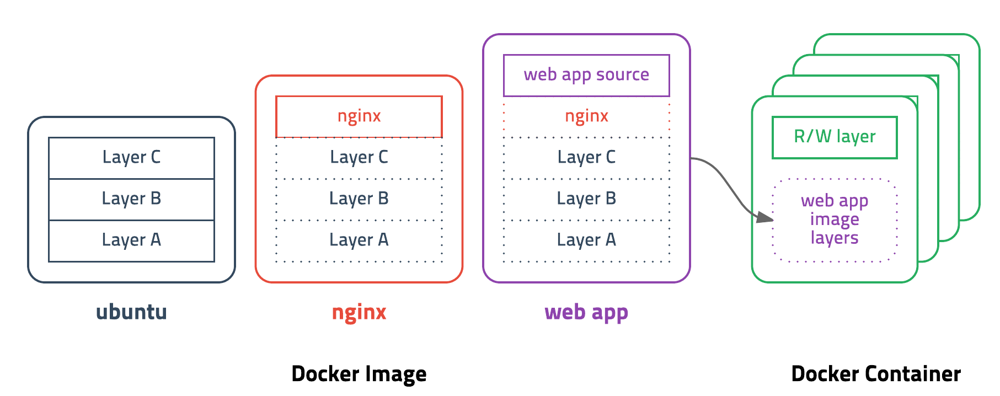

># 도커 *(docker)*
>
>`docker 명령어`
> 
>### 이미지, 컨테이너
###### 
https://cultivo-hy.github.io/docker/image/usage/2019/03/14/Docker%EC%A0%95%EB%A6%AC/

```
docker login    # 로그인(도커 허브)
```
---

## 이미지 *(image)*
Layer: `베이스`, `소스 코드`
>목록: `docker images`★
>
>삭제: `docker rmi 이미지`
> 
>---
> 
>다운로드: `docker pull 이미지[:태그]`*(도커 허브 → 하드 디스크)*
>
>검색: `docker search 이미지`*(도커 허브)*
>

## 컨테이너 *(container)*
≒ 가상 머신
>목록: `docker ps`*(실행 중)*, `docker ps -a`*(전체)*
> 
>삭제: `docker rm -f 컨테이너`
>
>---
> 
>터미널: `docker exec -it 컨테이너 bash`
> 
>생성: `docker create --name 컨테이너_이름 이미지` 
> 
>실행: `docker start 컨테이너`
>
>생성+실행 *(도커 파일 → 컨테이너)* ★
>```
>docker run \
>    --name 컨테이너_이름 \
>    -p 80:80 이미지 \
>    -d \
>
>-d: 백그라운드
>-p: 포워딩
>-v: 마운트(Volume)
>-e: 환경변수(ENV)
>--name: 컨테이너_이름
>```
>
>중지: `docker stop 컨테이너`

