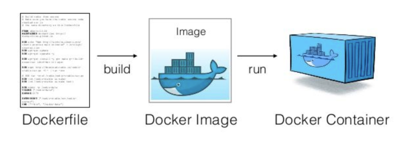

## 도커 파일 *(dockerfile)*
`이미지` 프로그램
###### 
```
FROM 베이스_이미지

MAINTAINER 정보    # 관리자

LABEL 키='값"    # 컨테이너 정보

COPY 

RUN 명령어

EXPOSE 
```
>`docker build -t 이미지 .`: 빌드
>
>`docker push 이미지`: 배포 *(도커 파일 → 허브)*

## 도커 컴포즈 *(docker-compose.yml)*
`docker compose [명령어]`
```
version: "3"    # 버전

services:    # 컨테이너
  컨테이너:      # --name
    container_name: 컨테이너_이름
    build:
      context: 도커파일_경로
      dockerfile: Dockerfile    # 도커파일
    image: 이미지
    restart: always    # 재시작(항상)
    volumes:    # -v
      - 로컬_경로:컨테이너_경로
    ports:
      - "로컬_포트번호:컨테이너_포트번호"
      
    #################################
      
    environment:    # ENV
      - 변수=값
      
    links:    # 컨테이너 연결
      - 외부컨테이너_이름    # 컨테이너 ← 외부컨테이너
    depends_on:
      - 외부컨테이너_이름
```
>실행: `docker compose up [-d]`
> 
>중지: `docker compose stop` 
> 
>삭제: `docker compose down`
> 
>---
> 
>로그: `docker compose logs`
> 
>설정: `docker compose config`


