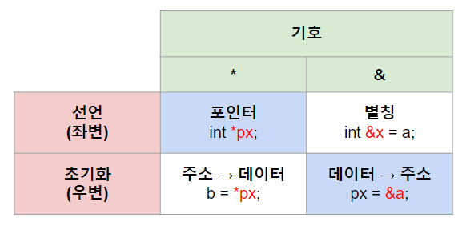

## 기호
###### 


## 주석
```
@class: 클래스 정의
@brief: 요약
@warning: 주의사항
@param: 파라미터

예) 클래스, 함수 또는 변수
```
```
/*
 * @class WriterBase
 * @brief Base class for a Writer. A Writer is an object to send messages through a 'Channel'
 * @warning One Writer can only write one channel.
 * But different writers can write through the same channel
 */
```


