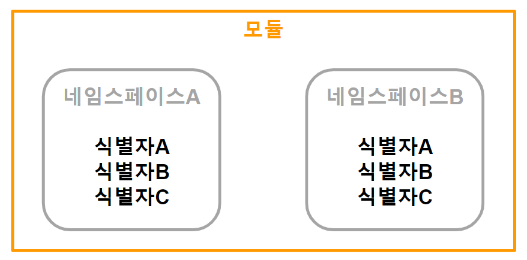

###### 
```
헤더: 최상위 폴더
네임스페이스: 폴더
자료형: 파일
:: : 경로
```

## 모듈

+ ### 외부
  `"파일.h"`

+ ### 내부 
  >`<iostream>`: 표준 I/O
  >
  >`<string>`: 문자열
  >
  >`<memory>`: 스마트 포인터 *(힙 영역)*
  
## 네임스페이스
`식별자` 메모리 공간

```
// 선언 //
namespace 네임스페이스
{
    식별자;
     ...
}

// 호출 //
using namespace 네임스페이스;    // import 네임스페이스
using 네임스페이스::식별자;       // from 네임스페이스 import 식별자

네임스페이스::식별자;    // 네임스페이스.식별자
식별자;                // 식별자
```
>```
>namespace baekjae    
>{
>    int year = 660;
>    void CentralAera()
>    {
>        cout << "충청도";
>    }
>}
>
>using namesapce baekjae;
>
>backjae::year;    // 660
>backjae::CentralArea();    // "충청도"
>```

+ ### std *(STaDard)*
  ```
  <iostream>
  cout: 출력 
  cin: 입력
  
  <vector>
  
  <string>
  string: 문자열
  
  <memory>
  shared_ptr: 포인터 여러개
  unique_ptr: 포인터 1개
  ```
