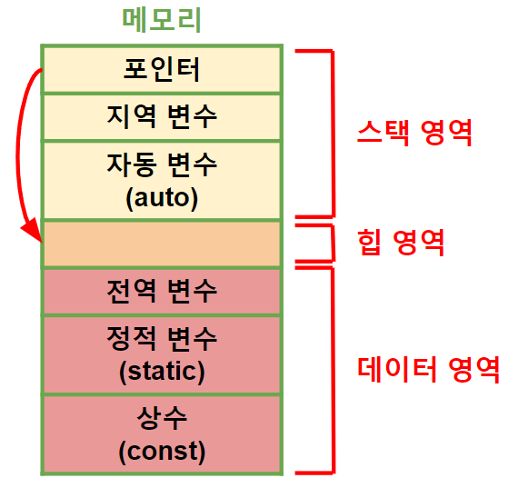

http://www.tcpschool.com/cpp/cpp_datatype_variable
># 변수 *(variable)*
>
>### 선언, 초기화
>### 선언 + 초기화
>### 복합 대입 연산자
###### 

---

## 선언
`자료형 변수, 변수;`
```
int a, b;
```

+ ### 1차원 배열
  `자료형 변수[];`, `자료형 변수[배열_길이];`
  ```
  int arr[];
  
  int arr[3];
  ```
+ ### 다차원 배열 *(m×n)*
  `자료형 변수[m][n];`

## 초기화
`변수 = 값, 변수 = 값;`
```
a = 3, b = 20;
```

+ ### 배열
  `변수[인덱스] = 값;`
  ```
  arr[1] = 10, arr[2] = 20, arr[3] = 30;
  ```
  
---

## 선언 + 초기화 ★
`자료형 변수 = 값, 변수 = 값;`
```
int a = 3, b = 20;    // 정수
double c = 3.14;     // 실수
char d = 'A'    // 문자
```

+ ### 상수
  `const 자료형 변수 = 값;`
  ```
  const int f = 50; 
  ```

+ ### 1차원 배열
  >숫자: `숫자_자료형 배열[] = {값1, ..., 값n};`
  >```
  >int arr[] = {1, 2, 3, 4, 5};
  >double arr1[3] = {10, 20, 30};
  >```
  >
  >문자: `char 배열[] = 문자열;`
  >```
  >char e[] = "apple";
  >```

+ ### 다차원 배열 *(m×n)*
    ```
    자료형 배열[][n] =
    {
        {값[0][0], ..., 값[0][n]}
                    ...
        {값[m][0], ..., 값[m][n]}
    };
    ```

---

## 복합 대입 연산자 ★
`연산자=`

+ ### *(숫자)* 변수
  
  >사칙: `+=`, `-=`, `*=`, `/=`
  >```
  >변수 += 3    // 변수 + 3
  >변수 -= 3    // 변수 - 3
  >변수 *= 3    // 변수 * 3
  >변수 /= 3    // 변수 / 3
  >```
  >
  >정수 나누기 *(몫)*: `//=`
  >```
  >변수 //= 2    // 변수 // 2
  >```
  >
  >나머지: `%=`
  >```angular2html
  >변수 %= 2    // 변수 % 2
  >```
  >
  >제곱: `**=`
  >```
  >변수 **= 2    // 변수 ** 2
  >``` 
