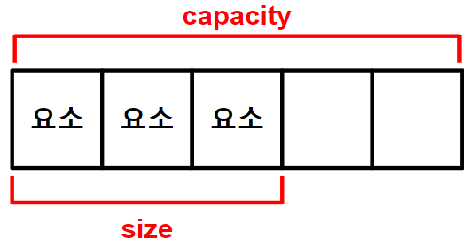

https://thebook.io/006842/0067/
># STL
>`배열`*(중복O)*, `집합`*(중복X)*
> 
```
#include <vector>
#include <unordered_set>
```
---

###### 
>선언: `객체_자료형<요소_자료형> 객체_이름;`
>```
>vector<int> v;
>unordered_set<int> us;
>```
>
>할당: `객체_이름.reserve(크기);`
>```
>v.reserve(5);    // { , , , , }
>us.reserve(3);    // { , , }
>```
>
>할당+초기화: `객체_이름.assign(크기, 값);`
>```
>v.assign(3, 100);    // {100, 100, 100}
>```
>---
>생성: `객체_자료형<요소_자료형> 객체_이름 = {값, 값};`
>```
>vector<int> v = {10, 20};
>unordered_set<int> us = {"국어", "수학", "영어"};
>```
>---
>추가 *(요소)*
>>배열: `객체_이름.push_back(값);`, `객체_이름.emplace_back(값)`;
>>```
>>v.push_back(10);    // {10, , , ,}
>>v.push_back(11);    // {10, 11, , ,}
>>v.push_back(12);    // {10, 11, 12, , }
>>```
>>집합: `객체_이름.insert(값);`, `객체_이름.emplace(값);` 
>>```
>>us.insert("국어");    // ("국어")
>>us.insert("영어");    // ("수학", "국어")
>>us.insert("수학");    // ("국어", "수학", "영어")
>>```
>
>삭제 *(요소)*: `객체_이름.clear();`*(전체)*, `객체_이름.erase(반복자, 반복자);`*(선택)*
>```
>v.clear();    // v.size() = 0, v.capacity() = 5
>us.clear();    // us.size() = 0, us.capacity() = 3
>```
>
>변경 *(크기)*: `객체_이름.resize(크기);`
>```
>v.resize(2);    // {10, 11}
>```
>
>확인
>>요소
>>```
>>객체_이름.front();    // 앞
>>객체_이름.back();    // 뒤
>>객체_이름.count();    // 검색(1:true, 0:false)
>>
>>us.count("수학");    // 1
>>us.count("과학");    // 0
>>```
>>
>>객체: `객체_이름.empty();`
>>```
>>v.empty();    // True, False
>>us.empty();    // True, False
>>```
>>
>>크기: `객체_이름.capacity();`, `객체_이름.size();`
>>``` 
>>v.capacity();    // 5
>>v.size();    // 3
>>```


