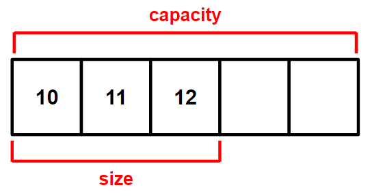

># 순차 컨테이너
>`배열`
>### Vector
```
// 요소 확인 //
객체_이름.front();    // 시작
객체_이름.back();    // 끝
```
---

## 배열 *(vector)*
`{값, 값}`
###### 
```
#include <vector>    // 배열

vector<int> v;

v.reserve(5);

v.push_back(10);    // {10, , , ,}
v.push_back(11);    // {10, 11, , ,}
v.push_back(12);    // {10, 11, 12, , }

v.clear();    // v.size() = 0, v.capacity() = 5 
```
>선언: `vector<자료형> 이름;`
>```
>vector<int> v;
>```
>
>할당: `이름.reserve(크기);`
>```
>v.reserve(5);
>```
>
>추가 *(뒤)*: `이름.push_back(값);`, `이름.emplace_back(값)`;
>```
>v.push_back(10);    // {10, , , ,}
>v.push_back(11);    // {10, 11, , ,}
>v.push_back(12);    // {10, 11, 12, , }
>```
>
>삭제 *(값)*
>>모두: `이름.clear();`
>>```
>>v.clear();    // v.size() = 0, v.capacity() = 5 
>>```
>>지정: `이름.erase(반복자, 반복자);` 
>
>크기
>>확인: `이름.capacity();`, `이름.size();`
>>```
>>v.capacity();    // 5
>>v.size();    // 3
>>```
>>
>>변경: `이름.resize(크기);`
>>```
>>v.resize(2);    // {10, 11}
>>```
>
>---
>
>생성+초기화: `vector<자료형> 객체_이름 = {값, 값};`
>```
>vector<int> v = {10, 20};
>```
>
>초기화: `이름.assign(크기, 값);`
>```
>v.assign(3, 100);    // {100, 100, 100}
>```
>>확인: `이름.empty();`
>>```
>>v.empty();    // True, False
>>``` 
