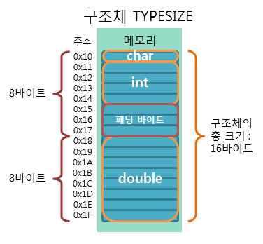

## 구조체 *(structure type)*
사용자 정의 `자료형` *(≒ 클래스)*
###### 
```angular2html
// 선언(세미콜론O)
struct 구조체
{
    자료형 변수;
};

// 초기화
구조체 구조체_변수 = {값1, ..., 값n};

// 호출
구조체_변수.변수
```
```
// 선언
struct book           // 책
{
    string title;     // 제목
    string author;    // 저자
    int price;        // 가격
};

// 초기화
book web_book = {"HTML", "홍길동", 28000};
book java_book = {"Java language", "이순신"};

// 호출
web_book.title;     // HTML
web_book.author;    // 홍길동
web_book.price;     // 28000

java_book.title;     // Java language
java_book.author;    // 이순신
java_book.price;     // 0
```

## 공용체 *(union type)*

## 열거체 *(enumerated types)*