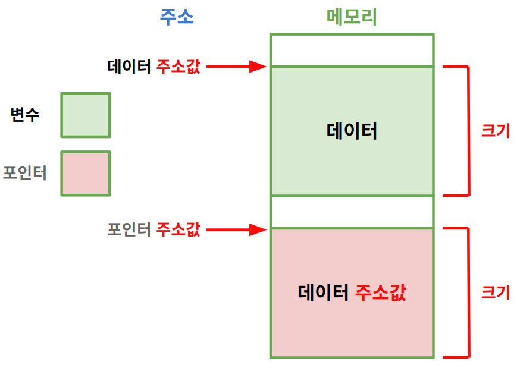

https://www.youtube.com/watch?v=Kh--nfm-3OQ&list=PLJqaIeuL7nuG6EmLPNiHfHi4WWN9C5HNd&index=72
># 포인터 *(PoinTeR)*
>`주소값` 메모리 공간 (변수 = *포인터)
> 
>### 선언, 초기화, 선언 + 초기화
>### 힙 영역 
###### 
```
주소값: '데이터' 첫 번째 주소
```
---

## 선언 + 초기화
`자료형 *포인터 = 주소값;`
```angular2html
int *pa = &a;
```

---

## 힙 영역
>생성: `자료형 *포인터 = new 자료형`
>```
>int *ptr = new int
>```
>
>삭제: `delete 포인터`
>```
>delete ptr
>```

