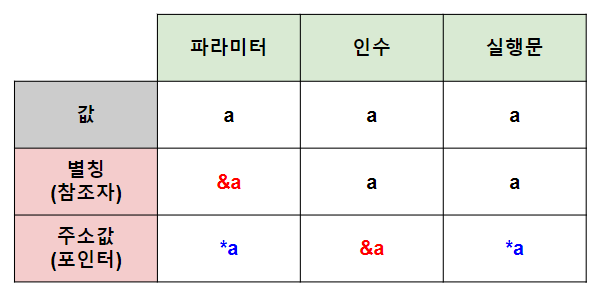

http://www.tcpschool.com/cpp/cpp_function_basic
># 함수
> 
>### 매개변수X, 반환X, 매개변수X＆반환X
```
// 선언
반환_자료형 함수(자료형 매개변수);

// 정의
반환_자료형 함수(자료형 매개변수) {
    실행문;
    
    return 반환;
}

// 호출
함수(매개변수);
```

+ ### 매개변수
  >###### 
  >값: `변수`
  > 
  >주소값: `*포인터`, `&참조자`*(구조체, 클래스)* 

---

## 매개변수X
`함수(void)`
```
// 선언 ★
반환_자료형 함수(void);

// 정의
반환_자료형 함수(void) {
    실행문;
    
    return 반환;
}

// 호출
함수();
```

## 반환X
`void 함수`
```
// 선언
void 함수(const 자료형 매개변수);

// 정의
void 함수(매개변수) {
    실행문;
}

// 호출
함수(매개변수);
```

## 매개변수X ＆ 반환X
`함수(void)`, `void 함수`
```
// 선언
void 함수(void);

// 정의
void 함수(void) {
    실행문;
}

// 호출
함수();
```