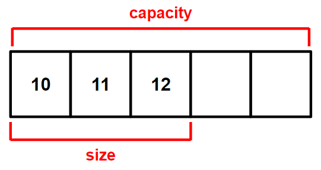

># STL *(Standard Template Library)*
>표준 `템플릿` 라이브러리 ★
>
>### 스마트 포인터, 배열, 사전
```angular2html
#include <memory>    // 스마트 포인터
#include <vector>    // 배열
#include <map>    // 사전

인스턴스.begin();    // 첫 번째 요소
인스턴스.end();    // 첫 번째 요소
```
---

## 배열 *(vector)*
`{값, 값}`
###### 
>선언: `vector<자료형> 이름;`
>```
>vector<int> v;
>```
>
>할당: `이름.reserve(크기);`
>```
>v.reserve(5);
>```
>
>추가: `이름.push_back(값);`
>```
>v.push_back(10);    // {10, , , ,}
>v.push_back(11);    // {10, 11, , ,}
>>>>>>> 9241a8fb604eb4fa39d9b159df1d53569fb0e7a4
>v.push_back(12);    // {10, 11, 12, , }
>```
>
>삭제 *(값)*: `이름.clear();`
>```
>v.clear();    // v.size() = 0, v.capacity() = 5 
>``` 
>
>크기
>>확인: `이름.capacity();`, `이름.size();`
>>```
>>v.capacity();    // 5
>>v.size();    // 3
>>```
>>
>>변경: `이름.resize(크기);`
>>```
>>v.resize(2);    // {10, 11}
>>```
>
>---
>
>생성+초기화: `vector<자료형> 인스턴스 = {값, 값};`
>```
>vector<int> v = {10, 20};
>```
>
>초기화: `이름.assign(크기, 값);`
>```
>v.assign(3, 100);    // {100, 100, 100}
>```
>>확인: `이름.empty();`
>>```
>>v.empty();    // True, False
>>``` 

## 사전 *(map)*
`{키: 값, 키: 값}`
>생성: `map<자료형1, 자료형2> 인스턴스;`
>```
>map<string, int> dict;
>```
>
>추가: `인스턴스[값1] = 값2;`
>```
>dict["수학"] = 100;
>```