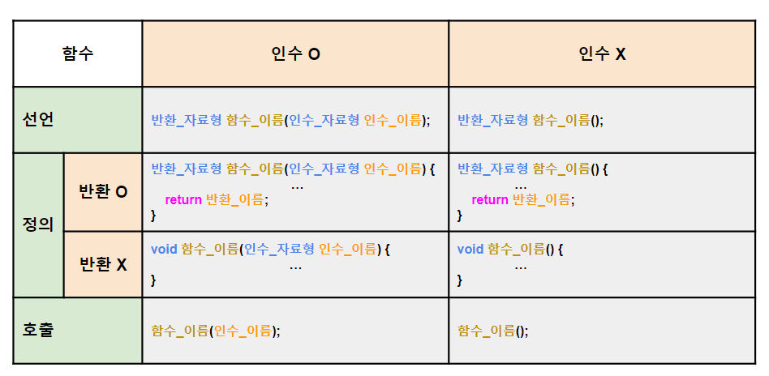
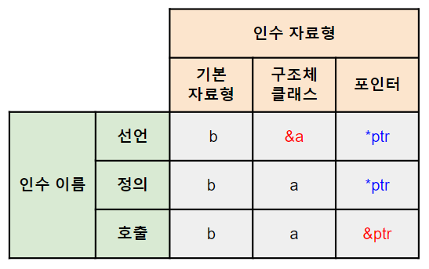

## 함수
###### 

+ ### 인수
  ###### 

---

## 콜백 함수 *(객체)*
`<function>`
###### 
```
#include <iostream>
#include <functional>

// 예시 콜백 함수: 두 정수를 더하고 결과를 출력하는 함수
void AddAndPrint(int a, int b) {
    std::cout << "Sum: " << a + b << std::endl;
}

int main() {
    using Callback = std::function<void(int, int)>;

    // 콜백 함수를 저장하는 std::function 객체 생성
    Callback callback = AddAndPrint;

    // 저장된 콜백 함수 호출
    callback(3, 5); // 출력: "Sum: 8"

    return 0;
}
```

---

## 람다 함수
```
auto 이름 = [] (인수_자료형 인수_이름) { return 반환_이름 }
``` 
