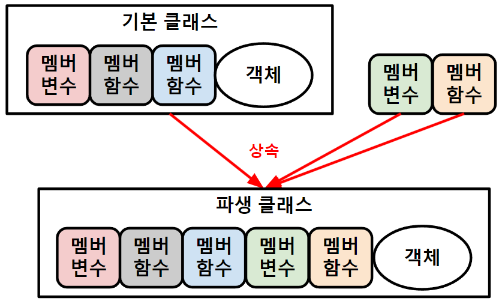

## 객체지향 프로그래밍 *(OOP, Object Oriented Programming)*
###### 

+ ### 객체 *(object, 인스턴스)*
  `멤버변수`*(attribute)*, `멤버함수`*(methods)* ★
  ```
  예) 
  객체: 동물, 사람, ...
  멤버변수: 이름, 나이, 몸무게, ...
  멤버함수: 자고있다, 먹고있다, ...
  ```
  >생성자 *(constructor)*: 멤버변수 초기화 `멤버함수`
  >
  >소멸자 *(destructor)*: 힙 영역 삭제 `멤버함수`


+ ### 클래스 *(class)*
  객체 `설계도`
  >상속 *(inheritance)*: 기본 클래스 + `멤버` 
  >###### 
  > 
  >오버라이드 *(override)*: 가상 함수 → 멤버 함수 `재정의`
  >###### 
  >```
  >가상 함수(virtual function): '재정의' 멤버 함수(기본 클래스)
  >```