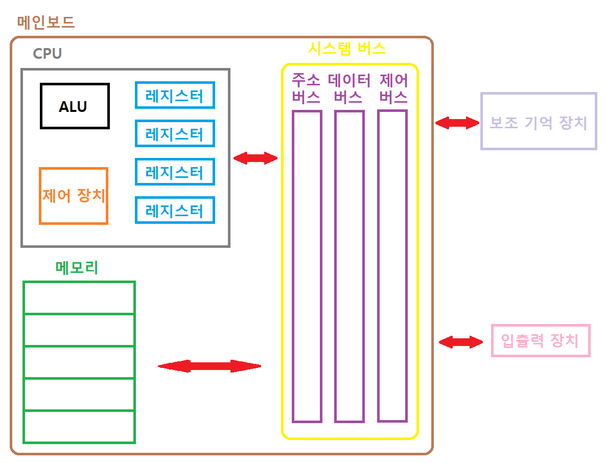

># 컴퓨터
>
>### 정보, 하드웨어
---

## 정보

+ ### 데이터 *(data)*
  `정적` 정보
  ```
  예) 이미지, 동영상, ...
  ```
  
+ ### 명령어 *(instruction)*
  `동적` 정보

## 하드웨어
###### 
###### 

+ ### 메인보드 *(Mainboard, 마더보드)*
  >CPU: `ALU`, `제어 장치`, `레지스터`
  >
  >메모리 *(RAM, Random Access Memory)*: `커널 영역`, `사용자 영역`
  >```
  >휘발성 메모리(Volatile Memory)
  >
  >DRAM (Dynamic RAM): 일정 시간 후, 데이터 삭제O
  >SDRAM(Synchronous DRAM): '클럭' 동기화 
  >DDRn SDRAM (Double Data Rate SDRAM): 대역폭(2ⁿ) 
  >```
  >시스템 버스: `주소 버스`, `데이터 버스`, `제어 버스`
  > 
  >캐시 *(cache)*: 임시 저장 장치 *(레지스터 ~ 메모리)*
  >```
  >코어 내부: L1 캐시, L2 캐시 
  >코어 외부＆CPU 내부: L3 캐시
  >
  >SRAM (Static RAM): 일정 시간 후, 데이터 삭제X
  >
  >예) TBL(Translation Lookaside Buffer): 페이지 테이블
  >```

+ ### 보조 기억 장치 *(Secondary Storage)*
  기초-하드웨어
  ```
  비휘발성 메모리(Non-Volatile Memory)
  
  예) 하드 디스크, SSD(Solid State Drive), USB 메모리, ...
  ```

+ ### 입출력 장치 *(I/O, Input/Output Device)*

