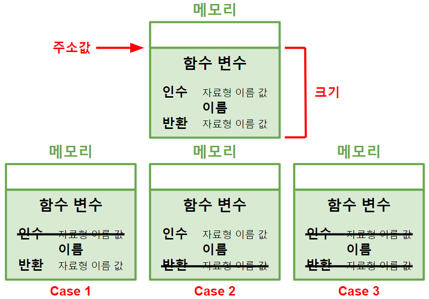
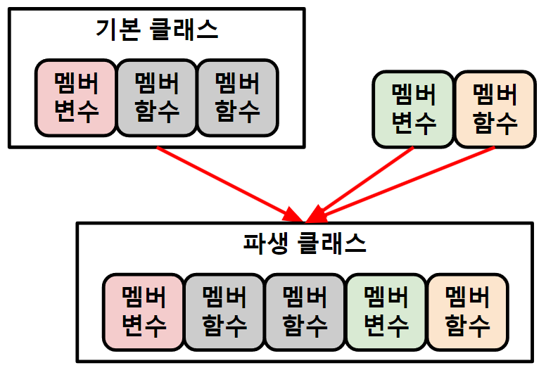

># 프로그래밍 *(Programming)*
>
>### 예약어, 식별자 
>### 함수형, 절차지향, 객체지향
>### 프레임워크
```
표현식(expression): 값

예) x*5, 2+3, Math.sqrt(25), ...
```
---

## 예약어 *(keyword, 키워드)*
`프로그래밍 언어` 단어
```angular2html
예) 구조체, int, float, if, while, return, ...
```

## 식별자 *(identifier)*
`개발자` 단어
```
예) 변수명, 함수명, 구조체명, 클래스명, ...
```

+ ### 단어`_`단어
  >변수명: `괄호X`
  >```
  >예) item_list
  >```
  >
  >함수명: `괄호O`
  >```
  >예) item_list()
  >```

+ ### 단어 첫 글자 `대문자`
  >클래스명
  >```
  >예) class Animal
  >```

---

## 함수형 *(Functional Programming)*
변수 개수 `최소화`
```angular2html
예) 스칼라, 하스켈, 클로저, F#, ...
```

+ ### 함수 *(function, 동사)*
  ###### 
  ```
  선언＆초기화 → 호출
  ```
  >파라미터 *(parameter)*: `입력값`
  >```
  >가변 매개변수: 매개변수 개수 '무한'
  >```
  >인수 *(argument)*: `호출값`
  >```
  >가변 인수: 인수 개수 '미정'
  >```
  >반환 *(return)*: `출력값`

+ ### 변수 *(variable, 명사)*
  `자료형` 메모리 공간 ★
  ###### 
  ```
  초기화(initialize): 첫번째 값 할당
  ```
  >상수 *(constant)*: `값` 변경X

## 절차지향 *(Preocedural Programming)*
`순차적`
```angular2html
예) C 언어
```

## 객체지향 *(OOP, Object Oriented Programming)*
`객체 단위`
###### 
```
예)
붕어빵 틀 - 클래스
붕어빵 - 인스턴스
```

+ ### 객체 *(object)*
  `멤버변수`*(attribute, 속성)*, `멤버함수`*(methods, 메소드)* ★
  ```
  예) 
  객체: 동물, 사람, ...
  멤버변수: 이름, 나이, 몸무게, ...
  멤버함수: 자고있다, 먹고있다, ...
  ```
  >생성자 *(constructor)*: 멤버변수 초기화 `멤버함수`*(반환X)*
  >
  >소멸자 *(destructor)*: 인스턴스 삭제 `멤버함수`*(반환X)*


+ ### 클래스 *(class)*
  객체 `설계도`
  ```
  상속(inheritance): 기본 클래스 '멤버' → 파생 클래스 '멤버'
  ```
  ###### 

  >인스턴스 *(instance)*: `클래스` 객체 ★ 

---

## 프레임워크 *(프로그래밍 도구)*
통합 개발 환경 *(IDE, Intergrated Development Environment)*
```angular2html
p.59

텍스트 에디터 + 코드 실행기

예) 이클립스, 인텔리제이, 파이참, ...
```
