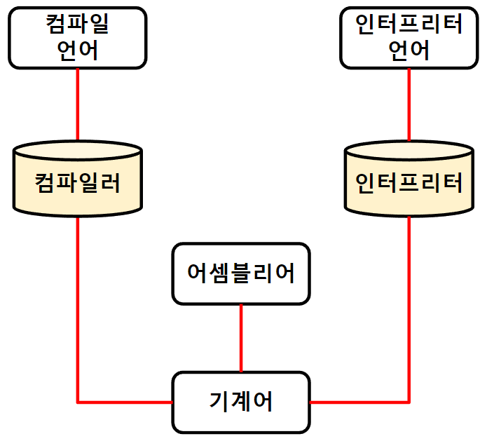

># 언어
>
>### 프로그래밍 언어, 기계어
>### 매니지드, 언매니지드
###### 

---

## 프로그래밍 언어 *(Programming Language)*
`소프트웨어` 개발 언어

+ ### 컴파일 언어 *(Compiled Language)*
  소스 코드`(전체)` ↔ 컴파일러 ↔ `목적 코드` *(기계어)*
  ```
  정적 타입(Statically Typed): 자료형 고정O
  
  예) C, C++, C#, 자바(→자바 바이트코드), 타입스크립트(→자바스크립트), 코틀린, 스위프트, 스칼라, Go, 러스트
  ```

+ ### 인터프리터 언어 *(Interpreted Language)*
  소스 코드`(한 줄)` ↔ 인터프리터 ↔ `목적 코드` *(기계어)*
  ```
  동적 타입(Dynamically Typed): 자료형 고정X
  
  예) 자바스크립트, 파이썬, 루비, PHP, 펄, R
  ```

+ ### 어셈블리어 *(Assembly Language)*
  `알파벳＆숫자`
  ```
  예) push rbp, add eax, mov rsp 
  ```

## 기계어 *(Machine Code)*
`명령어` *(0, 1)*
```
예) 0101 0101₂, 0101 1101₂
```

---

## 매니지드 언어 *(Managed Language)*
`프로그래밍 언어`가 `메인 메모리`를 관리하는 언어
```angular2html
예) 자바, 파이썬, ...
```

## 언매니지드 언어 *(Unmanaged Language)*
`개발자`가 `메인 메모리`를 관리하는 언어
```angular2html
예) C, C++, 어셈블리어
```