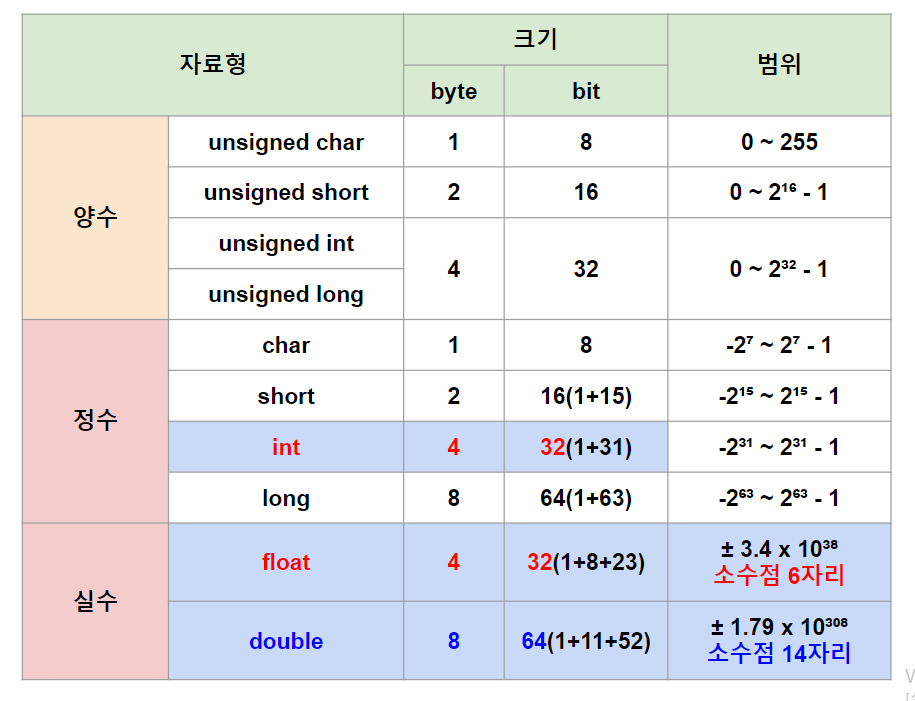

http://www.ktword.co.kr/test/view/view.php?m_temp1=2652
># 자료형 *(Data Type, dtype)*
>`데이터` 종류
>
>### 기본 자료형
>### 사용자 정의 자료형
>### 아스키, 유니코드
```
기본 자료형: 정수, 실수, 문자, ...
사용자 정의 자료형: 포인터, 문자열, 배열, 구조체, 클래스, 함수, 열거형, ...
```
###### 

---

## 기본 자료형

+ ### 정수
  부호(`0`: 양수, `1`: 음수) + 정수 
  ```
  예) int 13
  13 → 0 0000000 00000000 00000000 00001101₂
  
  -10 → 10 → 0 0000000 00000000 00000000 00001010₂
  → 1 1111111 11111111 11111111 11110101₂ (0₂ → 1₂)
  → 1 1111111 11111111 11111111 11110110₂ (+1₂)
  ```

+ ### 실수 *(floating point)* ★
  부호(`0`: 양수, `1`: 음수) + 지수 + 소수 *(IEEE 754 표준)*
  ```
  소수: 2⁻¹, 2⁻², ..., 2⁻²³, ..., 2⁻⁵²
  ```
  ```
  예) float 10.625
  10.625 → 1010.101₂ → 1.010101×2³₂
  → 소수: 010101₂ 
  → 지수: (2^7)-1 + 3 = 130 → 10000010₂
  → 0 10000010 010101 ... 0₂
  
  예) double -6.5 
  -6.5 → 110.1 → 1.101×2²
  → 소수: 101₂
  → 지수: (2^10)-1 + 2 = 1025 → 10000000001₂
  → 1 10000000001 1010 ... 0₂
  ```

+ ### 논리 *(bool, 1 bit, 파이썬)*
  `참(1₂)`, `거짓(0₂)`

---

## 아스키 *(1 byte)*
알파벳, 특수 문자, 제어 문자
```
범위(bit): -2^7 ~ 2^7-1(-128 ~ 127)
예) 'A' → 65 → 01000001₂
```

## 유니코드 *(1 ~ 4 byte)*
```
범위(bit): -2^15 ~ 2^15-1 
예) '가' → UTF-8 → 기계어
```

---

