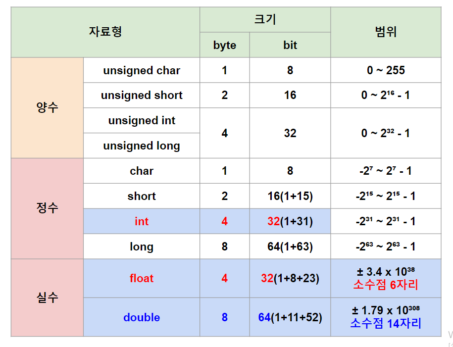

http://www.tcpschool.com/cpp/cpp_datatype_basic
># 자료형 *(Data Type, dtype)*
>`데이터` 종류
>
>### 정수, 실수, 불 
>### 배열, 구조체, 공용체, 포인터, void
>### 아스키, 유니코드 
###### 
```
char(acter): 부호, 알파벳
int(eger): 정수
```
---

## 정수
부호(`0`: 양수, `1`: 음수) + 정수 
```
예) int 13
13 → 0 0000000 00000000 00000000 00001101₂

-10 → 10 → 0 0000000 00000000 00000000 00001010₂
→ 1 1111111 11111111 11111111 11110101₂ (0₂ → 1₂)
→ 1 1111111 11111111 11111111 11110110₂ (+1₂)
```

## 실수 *(floating point)* ★
부호(`0`: 양수, `1`: 음수) + 지수 + 소수 *(IEEE 754 표준)*
```
소수: 2⁻¹, 2⁻², ..., 2⁻²³, ..., 2⁻⁵²
```
```
예) float 10.625
10.625 → 1010.101₂ → 1.010101×2³₂
→ 소수: 010101₂ 
→ 지수: (2^7)-1 + 3 = 130 → 10000010₂
→ 0 10000010 010101 ... 0₂

예) double -6.5 
-6.5 → 110.1 → 1.101×2²
→ 소수: 101₂
→ 지수: (2^10)-1 + 2 = 1025 → 10000000001₂
→ 1 10000000001 1010 ... 0₂
```

## 불 *(1 bit, 파이썬)*
`참(1₂)`, `거짓(0₂)`

---

## 아스키 *(1 byte)*
알파벳, 특수 문자, 제어 문자
```
범위(bit): -2^7 ~ 2^7-1(-128 ~ 127)
예) 'A' → 65 → 01000001₂
```

## 유니코드 *(1 ~ 4 byte)*
```
범위(bit): -2^15 ~ 2^15-1 
예) '가' → UTF-8 → 기계어
```

