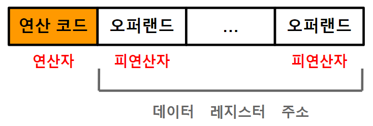
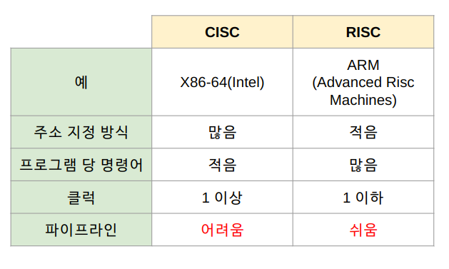
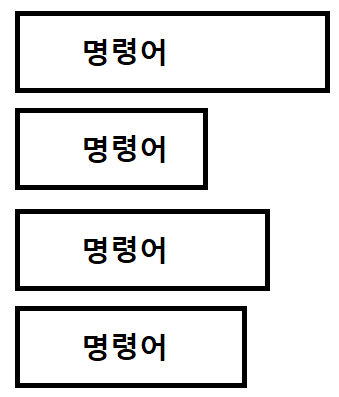
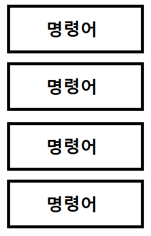

># 명령어 *(instruction)*
>`연산 코드` + `오퍼랜드` + ... + `오퍼랜드`
>
>### 오퍼랜드, 연산 코드
>### 명령어 집합 구조
###### 

---

## 오퍼랜드 *(operand)*
데이터, `레지스터`, `주소`

## 연산 코드 *(operation code)*

+ ### ALU
  오퍼랜드: `2개`
  ```
  산술
  ADD: 덧셈
  SUBTRACT: 뺄셈
  MULTIPLY: 곱셈
  DIVIDE: 나눗셈
  
  논리
  AND
  OR
  NOT
  COMPARE: 비교
  ```
  
+ ### 제어 장치
  >오퍼랜드: 0개
  >```
  >HALT: 프로세스 정지
  >``` 
  >오퍼랜드: 1개
  >```
  >스택 영역
  >PUSH: 저장
  >POP: 불러오기
  >
  >주소
  >INCREMENT: +1
  >DECREMENT: -1
  >
  >입출력 장치
  >START IO: 시작
  >TEST IO: 확인
  >
  >JUMP
  >CONDITIONAL JUMP
  >CALL
  >RETURN
  >```
  >
  >오퍼랜드: `2개`
  >```
  >MOVE: 복사
  >
  >STORE: 저장(레지스터 → 메모리)
  >LOAD: 데이터 불러오기(메모리 → 레지스터)
  >FETCH: 명령어 불러오기(메모리 → 레지스터)
  >
  >입출력 장치
  >WRITE: 쓰기(메모리＆레지스터 → 입출력 장치)
  >READ: 읽기(입출력 장치 → 메모리＆레지스터)
  >```

---

https://github.com/kangtegong/self-learning-cs
## 명령어 집합 구조 *(ISA, Instruction Set Architecture)*
###### 

+ ### CISC *(Complex Instruction Set Computer)*
  `가변길이` 명령어 처리 CPU
  ###### 

+ ### RISC *(Reduced Instruction Set Computer)* ★
  `고정길이` 명령어 처리 CPU
  ###### 


