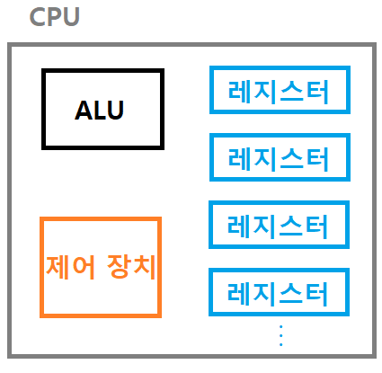
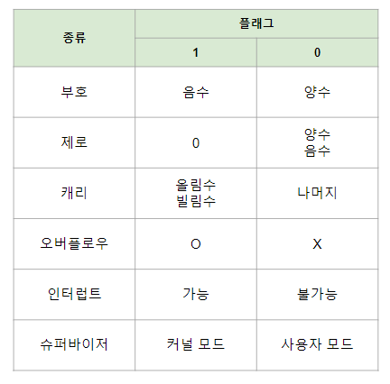

># CPU *(Central Processing Unit, 중앙 처리 장치)* 
>명령어 `처리`
>
>### 제어 장치, ALU, 레지스터
###### 
```
ALU + 제어장치 + 레지스터1 + ... + 레지스터n
```
---

## 제어 장치 *(CU, Control Unit)*
명령어 `실행`

## ALU *(Arithmetic Logic Unit)*
명령어 `실행` *(산술＆논리 연산)*

## 레지스터 *(register)*
`임시` 저장

+ ### 명령어 포인터 *(IP, Instruction Pointer)*
  `주소` *(명령어)* ★
  ```
  x86-64: 명령어 포인터
  ARM: 프로그램 카운터(PC, Program Counter)
  ```
+ ### 메모리 주소 레지스터 *(MAR, Memory Address Register)*
  `주소` *(주소, 데이터)*

+ ### 메모리 버퍼 레지스터 *(MBR, Memory Buffer Register)*
  `데이터`, `명령어`

+ ### 명령어 레지스터 *(IR, Instruction Register)*
  `명령어`
 
---

+ ### 플래그 레지스터 *(Flag Register)*
  ###### 

  >플래그 *(flag)*: 추가 정보
  >###### 
  >```
  >오버플로우: ㅣ값ㅣ > ㅣ레지스터ㅣ
  >```
  
+ ### 범용 레지스터 *(General Purpose Register)*
  `데이터`, `주소`

+ ### 스택 포인터 *(SP, Stack Pointer)*
  `주소`*(임시 데이터)*

+ ### 베이스 레지스터 *(Base Register)*
  프로세스 첫 번째 `물리 주소`
  >PTBR(Page Table Base Register): `페이지 테이블` 주소 

+ ### 한계 레지스터 *(Limit Register)*
  최대 `논리 주소`

