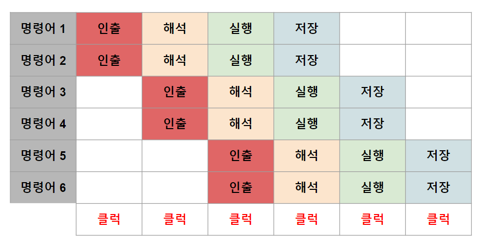

># 명령어 사이클 *(instruction cycle)*
>명령어 처리 `과정`
>
>### 인출, 간접, 실행, 인터럽트
>### 명령어 병렬 처리 
###### 

---

## 인출 사이클 *(fetch cycle)*
명령어 `불러오기` *(명령어 포인터 → 메모리 → 명령어 레지스터)*
###### 
```
1. 명령어 포인터 → 메모리 주소 레지스터
2. 제어 신호(제어 장치 → 제어 버스 → 메모리)
3. 메모리 주소 레지스터 → 주소 버스 → 명령어
4. 명령어 → 데이터 버스 → 메모리 버퍼 레지스터
5. 메모리 버퍼 레지스터 → 명령어 레지스터
```

## 간접 사이클 *(indirect cycle)*
`인출 사이클` x 2번
```
주소 지정 방식(간접, 레지스터 간접, 스택)
```

## 실행 사이클 *(execution cycle)*
명령어 `실행` *(명령어 레지스터 → 제어 장치 → CPU 내부 또는 외부)*
###### 
###### 

## 인터럽트 사이클 *(interrupt cycle)*
###### 
```
1. 인터럽트 → 인터럽트 플래그(1) → Interrupt Vector 
2. PUSH(레지스터 → 스택)
3. ISR 처리
4. POP(스택 → 레지스터)

인터럽트(interrupts): 명령어 사이클 '중단' 신호

ISR(Interrupt Service Routine): 인터럽트 처리 '프로세스'
Interrupt Vector: ISR '주소' 
```

+ ### 비동기 인터럽트 *(asynchronous interrupt)*
  `하드웨어` → CPU
  ```
  예) 타이머 인터럽트, 입출력 장치 인터럽트
  ```
  
+ ### 동기 인터럽트 *(synchronous interrupt)*
  `CPU` → CPU
  ```
  p.138
  폴트(fault): 예외 처리 후, 예외가 발생한 명령어 실행
  예) 페이지 폴트
  
  트랩(trap): 예외 처리 후, 예외가 발생한 다음 명령어 실행
  예) 디버깅
   
  중단(absort): 프로세스 강제 중단
  ``` 
  >시스템 호출 *(system call, 시스템 콜)*: `사용자 모드 → 커널 모드` 요청
  >```angular2html
  >프로세스
  >fork(): 복사(부모 프로세스 → 자식 프로세스)
  >exec(): 대체(자식 프로세스 → 자식 프로세스)
  >
  >동기화
  >acquire(): 잠금
  >release(): 해제
  >wait(): 대기
  >signal(): 진입
  >
  >파일 시스템(p.443)
  >mount():
  >umount():
  >
  >디렉터리(p.445)
  >mkdir(): 디렉터리 생성
  >
  >p.280
  >https:://github.com/kangtegong/self-learning-cs
  >```
  
---

## 명령어 병렬 처리 *(ILP, Instruction-Level Parallelism)*
```
파이프라인(pipeline): 인출 → 해석 → 실행 → 저장
```

+ ### 명령어 파이프라인 *(instruction pipeline)*
  `파이프라인`: 1개
  ###### 

+ ### 슈퍼스칼라 *(supterscalar)*
  `파이프라인`: 2개 이상
  ###### 
  ```
  예) 멀티스레드
  ```
+ ### 비순차적 처리 *(OoOE, Out-of-Order Execution)*
  `파이프라인`: 1개 이상
  ###### 
