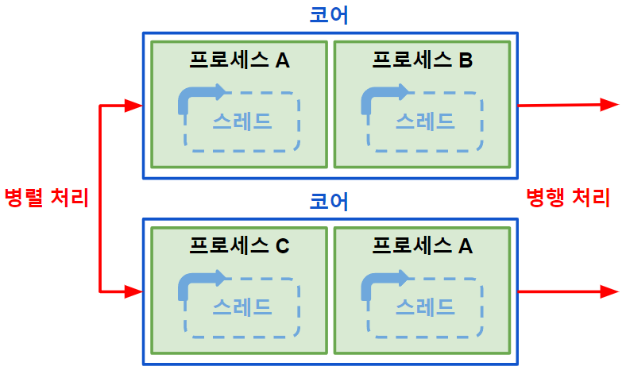

># 멀티 코어 CPU *(multi-core CPU)*
>코어 `2개 이상`
>### 클럭, 코어, 스레드
###### 
```
레지스터 세트 ↔ 명령어

주방 - CPU
요리사 - 코어
요리사 수준 - 스레드
요리사 속도 - 클럭

조리도구 - 캐시
조리대 - RAM
냉장고 - 보조 기억 장치
```
---

## 클럭 *(clock)*
명령어 처리 `시간`
```
예) 1 GHz: 1초 당 10억 개 처리
```

## 코어 *(core)*
명령어 처리 `장치` *(ALU + 제어 장치 + 레지스터 세트)*
```
예) 듀얼(2), 쿼드(4), ...
```

## 스레드 *(thread)*
###### 
```angular2html
멀티스레드(multithread): 스레드 '2개 이상'

병렬 처리(Parallel Processing): '여러 개'의 코어가 '프로세스'들을 '동시에' 처리
병행 처리(Concurrent Processing): '하나'의 코어가 '프로세스'들을 '컨텍스트 스위칭' 처리
```

+ ### 하드웨어 스레드
  `코어` 당 명령어 처리 `단위`
  ###### 
  ```
  예) n코어 2n스레드
  ```

+ ### 소프트웨어 스레드
  `프로세스 실행` 단위 *(스레드 + ... + 스레드 = 프로세스)*
  ###### 


