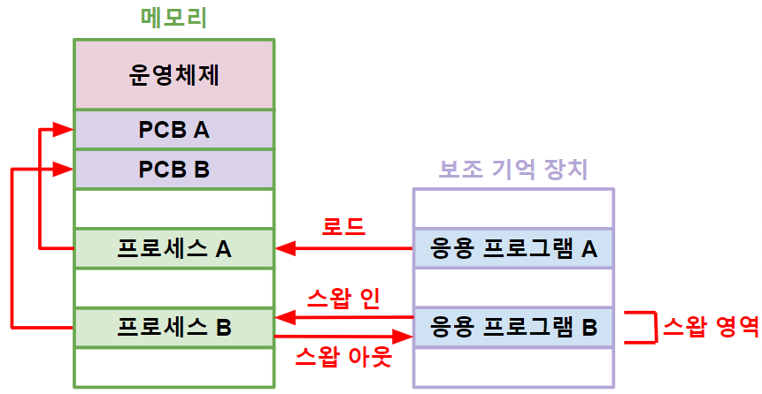

># 프로세스 *(proc ess)*
>`프로그램` *(보조 기억 장치 → 메모리)*
>
>### 계층 구조, 컨텍스트 스위칭, IPC
>### 포그라운드, 백그라운드
###### 
```
스와핑(swapping): 프로세스(메모리) ↔ 응용 프로그램(스왑 영역)
```
---

## 프로세스 계층 구조
`부모 프로세스`, `자식 프로세스`
###### 

## 컨텍스트 스위칭 *(context switching)*
프로세스 `전환`
###### 

## IPC *(Inter-Process Communication)*
프로세스 `통신`

+ ### 공유 메모리 *(shared memory)*
  ###### 
  >쓰기 시 복사 *(copy on write)*: `페이지`
  >###### 


+ ### 소켓 *(socket)*
  프로토콜

---

## 포그라운드 프로세스(foreground process)
사용자 인터페이스 `O`

## 백그라운드 프로세스(background process)
사용자 인터페이스 `X`

+ ### 서비스 *(service)*
  `윈도우` 운영체제

+ ### 데몬 *(daemon)*
  `유닉스` 운영체제


