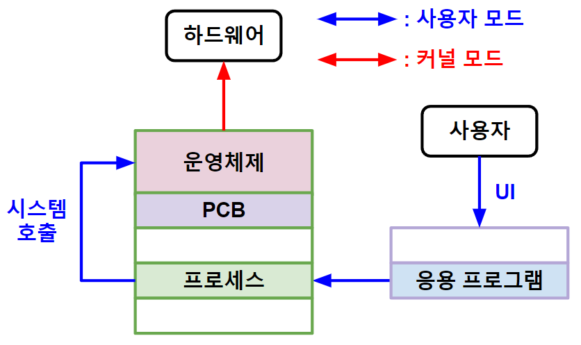

># 운영체제 *(OS, Operating System)*
>`자원` 관리
>### 커널, UI
###### 
```angular2html
자원(resource): 프로세스 '요소'

p.279 가상머신

예) 윈도우, 유닉스(맥OS, 리눅스), 안드로이드, IOS, ...
```
---

## 커널 *(kernel)*
`운영체제 ↔ 하드웨어` 인터페이스 *(커널 모드)*

+ ### CPU 스케줄링 *(CPU scheduling)*
  `프로세스 상태` 변경
  ###### 
  ```
  생성(new): 보조 기억 장치 → 메모리
  준비(ready): 'CPU' 실행 대기 ★
  실행(running): 메모리 → CPU
  대기(blocked): '비동기 인터럽트' 요청 ★
  종료(terminated): PCD＆프로세스 삭제
  
  디스패치(dispatch): 준비 → 실행
  비동기 인터럽트 사이클: 대기 → 준비
  
  p.329
  ```
  
  >선점형 *(preemptive scheduling)*: `프로세스` 중단O
  >```
  >라운드 로빈(round robin scheduling): 선입 선처리 + 타임 슬라이스
  >``` 
  >
  >비선점형 *(non-preemptive scheduling)*: `프로세스` 중단X 
  >```
  >선입 선처리(FCFS, First Come Served Scheduling)
  >최단 작업 우선(SJFS, Shortest Job First Scheduling):
  >``` 
  >선점형 + 비선점형 ★
  >```
  >최소 잔여 시간 우선(SRTS, Shortest Remaining Time Scheduling): 라운드 로빈 + 최단 작업 우선
  >
  >우선순위(priority scheduling)
  >다단계 큐(multilevel queue scheduling): 우선순위 + 준비 큐 '2개 이상'
  >다단계 피드백 큐(multilevel feedback queue scheduling): 다단계 큐 + 준비 큐 '상호작용' ★
  >``` 
  
+ ### 동기화 *(synchronization)*
  `공유 자원` 관리
  >상호 배제 *(mutual exclusion)*: `공유 자원` 동시 할당X
  >######  
  >```
  >자물쇠: '상호 배제' 도구
  >임계 구역(critical section): 공유 자원 '코드 영역'
  >```
  >
  >>뮤텍스 락 *(mutex lock, MUTual EXclusion lock)*: 임계 구역 `1개`
  >>######   
  >>```
  >>뮤텍스(자물쇠): lock
  >>acquire(잠금): lock = true
  >>release(해제): lock = false
  >>```
  >>
  >>카운팅 세마포 *(counting semaphore)*: 임계 구역 `2개 이상`
  >>######    
  >>``` 
  >>뮤텍스(자물쇠): S
  >>wait(대기): S ≤ 0
  >>signal(진입): S > 0
  >>```
  >>
  >>모니터 *(monitor)*: 공유 자원 + `인터페이스`
  >>```
  >>p.358
  >>```

+ ### 파일 시스템 
  15장

+ ### 메모리
  14장

## UI *(User Interface, 사용자 인터페이스)*
`사용자 ↔ 응용 프로그램` 인터페이스 *(사용자 모드)*

+ ### CLI *(Command Line Interface, 터미널)* ★
  `명령어`
  >응용 프로그램: `쉘` *(shell)*
  >```
  >윈도우: CMD(CoMmanD prompt)
  >리눅스: Bash(Bourne-Again SHell) ★, PowerShell, ... 
  >```

+ ### GUI *(Graphical User Interface)*
  `그래픽 요소`
  ```
  응용 프로그램: 아이콘, 툴바, 버튼, 메뉴창, 탐색기, ...
  ```
