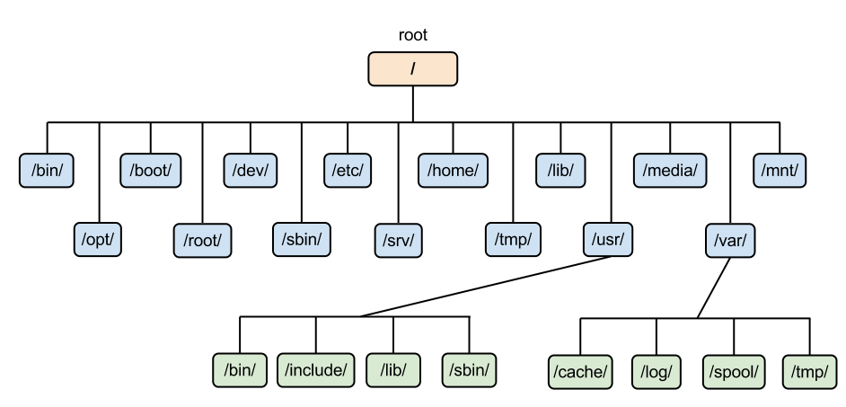

># 파일 시스템 
>
>### 파일, 디렉터리
---

## 파일 *(file)*
`이름.확장자`*(보조 기억 장치)*

+ ### 속성 *(metadata, 메타데이터)*
  >확장자 *(extension)*
  >```
  >실행: exe(cutable), com(mand), bin(ary)
  >목적(object): obj, o
  >소스 코드: sh(Shell Script), c, cpp, cc, java, asm(ASseMbly), py
  >라이브러리: lib, a, so(Shared Object), dll(Dynamic Link Library)
  >백업/압축: tar(Tape ARchive), deb(Debian Binary Package), rar(Roshal ARchive), zip
  >
  >워드 프로세서: xml, rtf, doc, docx
  >멀티미디어: mp3, mp4, avi(Audio Video Interleave)
  >```

## 디렉터리 *(directory, 폴더)*
###### 
```angular2html
절대 경로(absolute path): '루트 디렉터리' 시작
예) /A/b, /B/C/d

상대 경로(relative path): '현재 디렉터리' 시작
  현재 디렉터리: .
  상위 디렉터리: .. 
예) ./C/d (현재 디렉터리: B)   ../B/C/c (현재 디렉터리: A)
```

+ ### 리눅스
  ###### 
  ```
  /: 루트(최상위 디렉터리)
  
  home: 사용자 계정
  root: 루트 계정
  
  bin(ary): 사용자 명령어
  sbin(System BINaries): 루트(sudo) 명령어
  
  lib(rary): 라이브러리
  usr(Unix System Resource): 응용 프로그램
  
  dev(ice): 하드웨어
  media: 보조 기억 장치
  
  opt(ional): 패키지
  etc(ET Cetera): 환경 설정
    sudoers: 루트 권한
    passwd
  
  sys(tem): 커널 모드
  proc(ess): PCB
  run(time): 프로세스 상태(실행)
  srv(SeRVice): 서비스(서버)
  
  tmp(TeMPorary): 임시 데이터
  var(iable): 동적 데이터(데이터베이스, 로그, 캐시, ...) 

  mnt(MouNT): 마운트(파일 시스템)
  boot(strap): 부팅
  ```