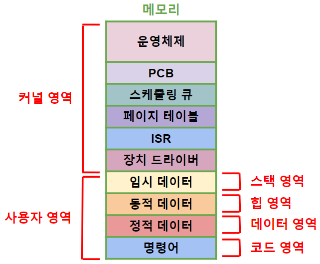
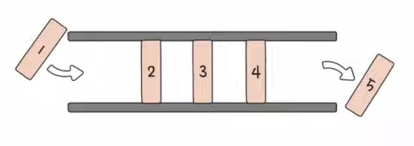
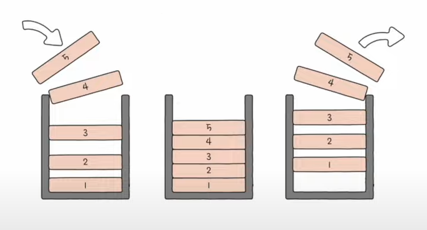

># 메모리 *(RAM, Random Access Memory)*
>프로세스 `저장`
> 
>### 커널 영역, 사용자 영역
###### 
```
p.292
```
---

## 커널 영역 *(kernel segment)*

+ ### 스케줄링 큐 *(scheduling queue)*
  `CPU 스케줄링`
  ```
  큐(queue): FIFO(First In First Out, 선입선출) '자료 구조'
  ```
  ###### 

+ ### PCB *(Process Control Block, 프로세스 제어 블록)*
  프로세스 `자료 구조`
  ```angular2html
  PID(Process ID): 프로세스 번호
  PPID
  
  프로세스 '상태'
  우선순위
  페이지 테이블
  
  레지스터 값
  파일
  입출력 장치
  ```
  >PPID *(Parent PID)*: 부모 프로세스 `PID`
  >```
  >유닉스 운영체제: init
  >리눅스 운영체제: systemd
  >맥OS 운영체제: launchd
  >```
  >
  >페이지 테이블 *(page table)*: 페이징 `정보`
  >###### 
  >```
  >유효 비트(valid bit): '페이지' 저장 위치(메모리, 보조 기억 장치)
  >보호 비트(protection bit): 권한(Read, Write, eXecute)
  >참조 비트(reference bit)
  >수정 비트(modified bit)
  >
  >페이지 폴트(page fault): 페이지(유효 비트: 0) '접근' 
  >```

---

## 사용자 영역 *(user segment)*

+ ### 스택 영역 *(stack segment)*
  `임시` 데이터
  ```
  예) 포인터, 지역 변수★, 매개변수, return 값, ...
  ```
  >스택: LIFO *(Last In First Out, 후입선출)* `자료 구조`
  >###### 
  
+ ### 힙 영역 *(heap segment)*
  `동적` 데이터
  ```
  예) 자료형
  ```
  
+ ### 데이터 영역 *(data segment)*
  `정적` 데이터
  ```
  예) 전역 변수, 정적 변수(static), 상수, ...
  ```
  
+ ### 코드 영역 *(code segment, 텍스트 영역)*
  `명령어` *(read-only)*


