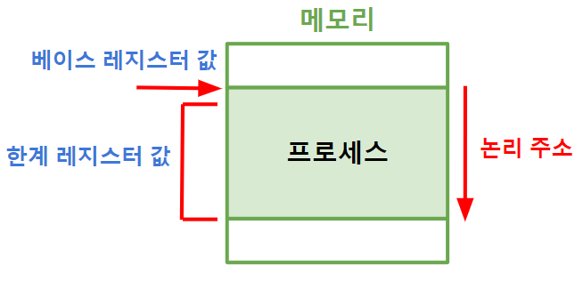
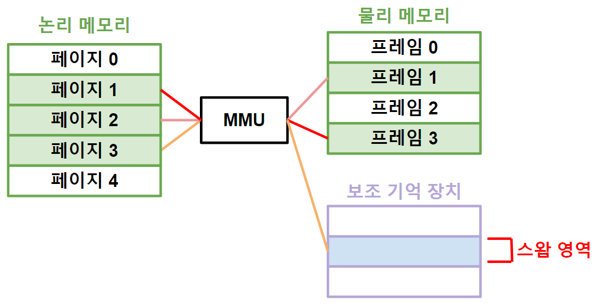

># 주소 *(address)*
>메모리 `위치` *(n번지)*
>
>### 페이징, 주소 지정 방식
###### 
```
논리 주소(logical address): '프로세스' 상대 주소(페이지 번호)
물리 주소(physical address): '메모리' 절대 주소(프레임 번호)
```
---

## 페이징 *(paging)*
`매핑` *(논리 주소 ↔ 물리 주소)*
###### 
```
LRU(Least Recently Used): 가장 오랫동안 사용되지 않는 페이지 '스와핑'

예) 논리 주소(<2,1>)
페이지2 + 1번지 ↔ 프레임1 + 1번지 
```

+ ### 메모리 관리 장치 *(MMU, Memory Management Unit)*
  `페이징` 하드웨어
  
## 주소 지정 방식 *(Addressing Mode)*
```
속도: 즉시 > 레지스터 > 직접 > 간접
```

+ ### 즉시 *(immediate)* 
  `데이터`
  ###### 

+ ### 레지스터 *(register)* 
  `레지스터`*(데이터)*
  ###### 
 
+ ### 직접 *(direct)*
  `주소`*(데이터)*
  ###### 

---

+ ### 간접 *(immediate)*
  `주소`*(주소)*
  ###### 

+ ### 레지스터 간접 *(Register Indirect)*
  `레지스터`*(주소)*
  ###### 
 
+ ### 스택 *(Stack)*
  `스택 포인터 레지스터`*(주소)*
  ###### 
 
+ ### 변위 *(displacement)* ★
  ```
  예) 페이징
  ```
  >상대 *(relative)*: `논리 주소` + `논리 주소`
  >######  
  > 
  >베이스 레지스터 *(Base-Register)*: `물리 주소` + `논리 주소` ★
  >###### 
  >```
  >예) 
  >베이스 레지스터 값 = 2000
  >논리 주소 = 1100
  >
  >물리 주소 = 2000 + 1100 
  >```


