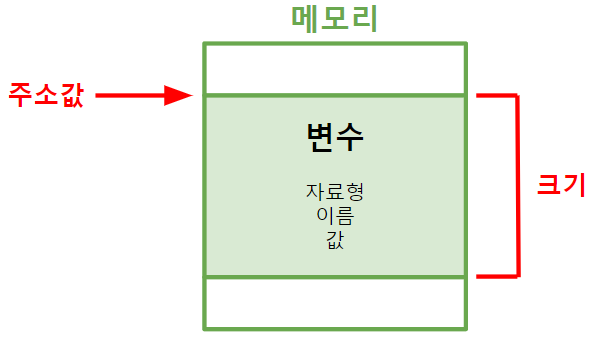

># 변수 *(variable)*
>`자료형` 메모리 공간 ★
> 
>### 포인터 변수
###### 
```
예) 포인터 변수, 구조체 변수, 클래스 변수, ...
```
>선언: `자료형` + `이름`
> 
>초기화 *(initialize)*: 첫 번째 `값`
>
>주소값: 데이터 `첫 번째` 주소
###### 
```
상수(constant): '값' 변경X
```
---

## 포인터 변수 *(pointer)*
###### 
+ ### NULL 포인터
  `주소값 = 0`
  ###### 
  
+ ### 동적 변수
  `할당`*(allocation)* → `해제` ★
  ###### 
