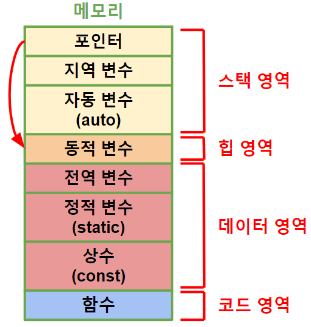

###### 

---

## 변수 *(variable)*
`자료형` 메모리 공간 ★
```
예) 지역 변수, 전역 변수, 자동 변수, 정적 변수
```
>선언: `자료형` + `이름`
> 
>초기화 *(initialize)*: 첫 번째 `값` 할당
> 
>---
> 
>주소값: 데이터 `첫 번째` 주소
> 
>상수 *(constant)*: `값` 변경X
###### 

## 포인터 *(pointer)*
`주소값` 메모리 공간
###### 

+ ### NULL 포인터
  `주소값` = 0
  ###### 

+ ### 힙 영역
  ###### 
  `할당`*(allocation)* → `해제` 
