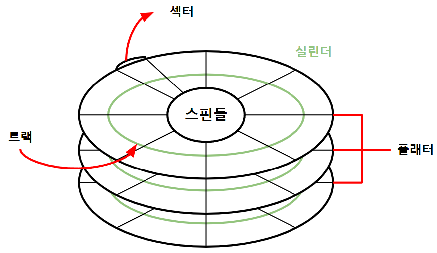
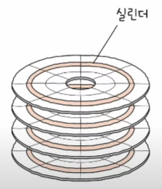

># 보조 기억 장치 *(Secondary Storage)*
>
>### 하드 디스크, 플래시 메모리
---

## 하드 디스크 *(HDD, Hard Disk Drive)*
###### 

+ ### 헤드
  `데이터` 읽기＆쓰기

+ ### 스핀들 *(spindle)*
  `플래터` 회전
  >RPM *(Revolution Per Minute)*: 1분 당 `회전수`
  >```
  >예) 15000 RPM → 1분 당 15000바퀴
  >```

+ ### 플래터 *(platter)*
  `데이터` 저장 
  ###### 
  >트랙 *(track)*: 
  > 
  >섹터 *(sector)*: 최소 전송 단위
  > 
  >실린더 *(cylinder)*: 같은 트랙
  >###### 
  
## 플래시 메모리 *(영어)*
정의
###### 
```angular2html
예)
```

+ ### 부종류1 *(영어)*
  ```
  예)
  ```
  >부부종류1
  >```
  >예)
  >```
  >
  >부부종류2
  >```
  >예)
  >```