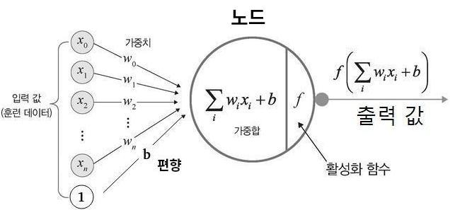

># 인공 신경망 *(ANN, Artificial Neural Network)*
>뇌에 있는 `생물학적 뉴런의 네트워크`의 과정을 `수학적`으로 만든 신경망
>
>### 퍼셉트론
>### 피드 포워드, 순환 
###### 
```
자극 = 입력     뉴런 = 노드     전달 = 출력

예) 퍼셉트론, DNN, RNN, CNN, ...
```
---

## 퍼셉트론 *(Perceptron, 뉴런)*
인공 신경망을 구성하는 `기본 단위`
###### 
```
입력값 → 가중합 → 활성화 함수 → 출력값
```

+ ### 가중합 *(Weighted Sum, ｚ)*
  `입력값`과 `가중치`를 곱해서 `편향`을 더한 결과값
  ```
  입력값1 x 가중치1 + ... + 입력값n x 가중치n + 1 x 편향
  ```
  >가중치 *(weight, Ｗ)*: 중요도
  >
  >편향 *(bias, ｂ)*: 활성화 정도

+ ### 활성화 함수 *(Activation Function, ｆ)*
  `가중합`을 `출력값`으로 변환하는 함수
  ######  
  >소프트맥스 *(softmax)*
  >######  
  >```
  >예) 출력층(DNN, CNN)
  >```
  >
  >렐루 *(ReLU)* ★
  >######  
  >```
  >예) 은닉층
  >```
  >
  >리키 렐루 *(Leaky ReLU)* ★
  >######  
  >```
  >예) 은닉층
  >```
  >
  >하이퍼볼릭 탄젠트 *(Hyperbolic Tangent)*
  >######  
  >```
  >예) 순환층(RNN)
  >```
  >
  >계단 *(Step)*
  >######  
  >```
  >예) 출력층(단층 퍼셉트론)
  >```
  >
  >시그모이드 *(sigmoid)*
  >######  

---

## 피드 포워드 신경망 *(FFNN, Feed-Forward Neural Network)*
입력층 → 은닉층 → 출력층
  
## 순환 신경망 *(RNN, Recurrent Neural Network)*
은닉층 → 출력층+은닉층
