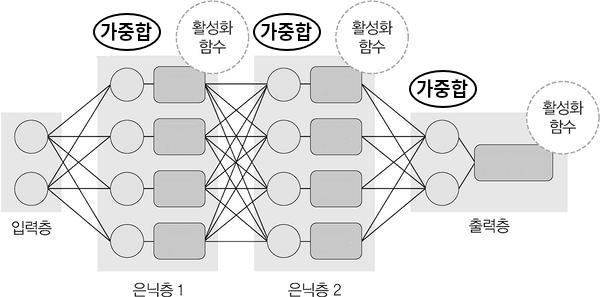

># 층 *(layer)*
>`노드` *(뉴런)* 집합
>
>### 입력층, 은닉층, 출력층
>### 완전연결층
###### 

---

## 입력층 *(Input Layer)*
`특성` 노드 집합 *(입력값 → 입력층 → 출력값)*
  
## 출력층 *(Output Layer)*
`출력` 노드 집합 *(입력값 → 출력층 → 예측값)*

## 은닉층 *(Hidden Layer)*
`입력층`과 `출력층` 사이에 있는 모든 층 *(입력값 → 은닉층 → 출력값)*

---

## 완전연결층 *(FC, Fully-Connected layer)*
`현재 층`의 모든 노드가 `이전 층`의 모든 노드와 연결된 층 *(밀집층)*

