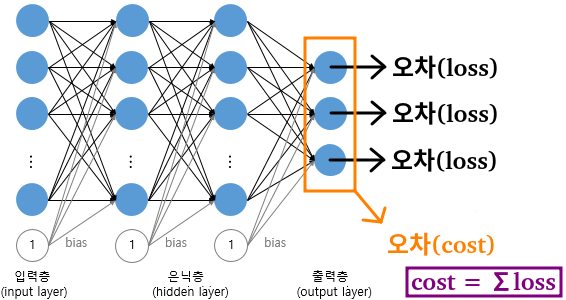
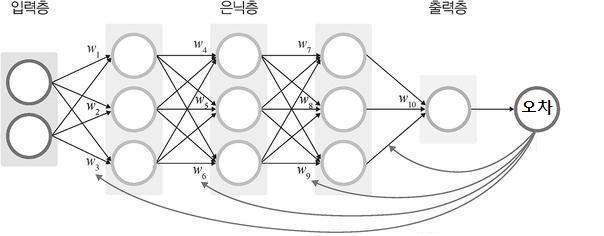
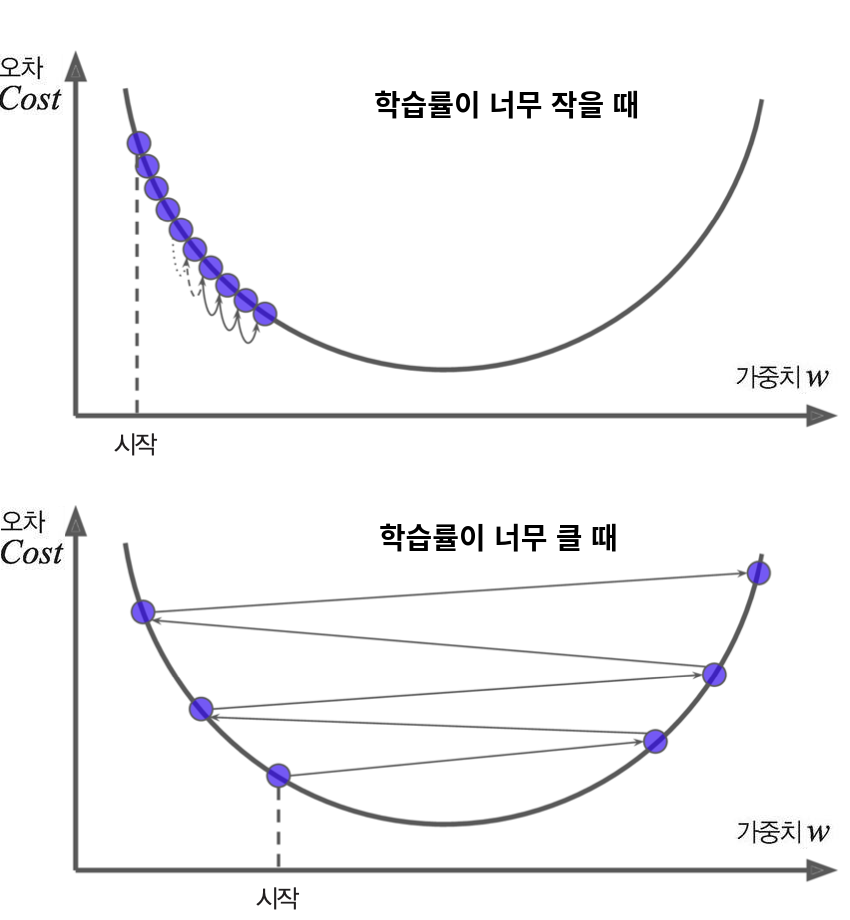
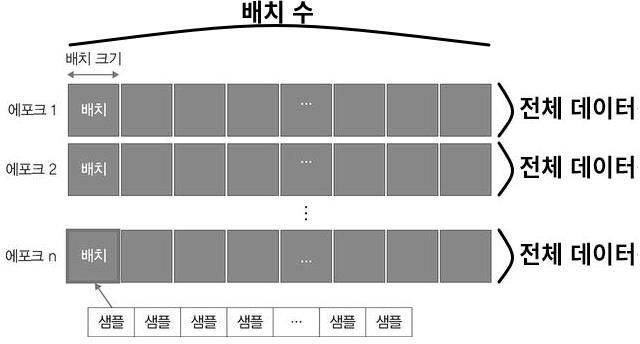
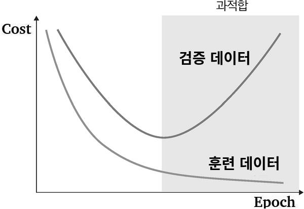
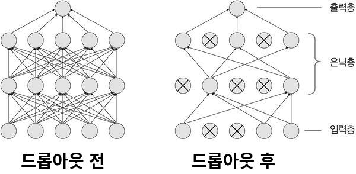

># 신경망 학습
>순전파 → 역전파 → 순전파 → 역전파 → ...
>
>### 순전파, 역전파
>### 과적합 
###### 
```
가중치＆편향을 랜덤하게 초기화한 후
에포크를 반복하고 옵티마이저를 사용하여
최적의 가중치＆편향을 찾아가는 과정
```
---

## 순전파 *(Forward Propagation)*
`오차` *(예측값 - 실제값)* 계산
```
입력층 → 은닉층 → 출력층
```
###### 
>평균 제곱 오차 *(MSE, Mean Squared Error)*
>###### 
> 
>크로스 엔트로피 오차 *(CEE, Cross Entropy Error)*
>###### 

+ ### 손실 함수 *(Loss Function)*
  `샘플 1개`에 대한 `오차`를 출력하는 함수 *(출력층 노드: 1개)*

+ ### 비용 함수 *(Cost Function)*
  `전체 데이터`에 대한 `오차`를 출력하는 함수 *(출력층 노드: n개)*

## 역전파 *(Back Propagation)*
`파라미터`*(가중치, 편향)* 업데이트
###### 
```
출력층 → 은닉층 → 입력층
```

+ ### 옵티마이저 *(optimizer)* ★
  `오차`의 `최솟값`을 구하는 알고리즘
  ```
  경사 하강법, 적응적 학습률
  ```
  
  ### 경사 하강법 *(Gradient Descent)*
  비용 함수의 `접선의 기울기`를 이용해 오차가 최소가되는 방향으로 `가중치`를 수정하는 방법
  ###### 
  >학습률 *(Learning Rate, α)*: 한 번 학습할 때, 학습할 양
  >###### 

  >배치 *(Batch)*
  >######  
  >```
  >전체 데이터 = 배치1 + ... + 배치n
  >
  >에포크(epoch): 전체 데이터가 학습에 한 번 사용된 횟수
  >예) m번: 전체 데이터, 전체 데이터, ..., 전체 데이터
  >
  >배치 크기(Batch Size): 배치의 데이터 개수
  >예) ㅣ배치ㅣ = 2ⁿ개
  >
  >배치 수(step, iteration): 에포크 당 파라미터 업데이트 횟수(n)
  >예) 전체 데이터 / ㅣ배치ㅣ
  >```
  >######  

  >확률적 경사 하강법 *(SGD, Stochastic Gradient Descent)*
  >```
  >배치 크기 = 1
  >```
  >
  >미니 배치 경사 하강법 *(Mini-Batch Gradient Descent)* ★
  >###### 
  >```
  >배치 크기 = 2 이상
  >```
  >
  >배치 경사 하강법 *(BGD, Batch Gradient Descent)*
  >```
  >배치 크기 = 전체 데이터 수
  >```

  ### 적응적 학습률 *(Adaptive Learning Rate)* ★
  https://thebook.io/080289/ch04/02/03-08/
  ######  
  >운동량
  >```
  >Momentum: 관성 추가
  >
  >NAG(Nesterov Accelerated Gradient)
  >```
  >속도
  >```
  >Adagrad(Adaptive gradient): 가중치 업데이트 횟수에 따라 학습률을 조정하는 방법
  > 많이 변화한 변수는 최적 값에 근접했을 것이라는 가정하에 작은 크기로 이동하면서 세밀하게 값을 조정하고, 반대로 적게 변화한 변수들은 학습률을 크게 하여 빠르게 오차 값을 줄이고자 하는 방법
  >- 기울기 소실
  >
  >Adadelta(Adaptive delta)
  >
  >RMSProp: 학습률(크기 → 비율)
  >```
  >속도 + 운동량
  >
  >```
  >Adam(RMSProp + Momentum): 방향 + 학습률
  >```

+ ### 기울기 소멸 *(Gradient Vanishing)*
  `기울기`가 급격하게 감소하여 `파라미터` 업데이트가 불가능
  ###### 
  ###### 
  >활성화 함수
  >``` 
  >시그모이드, 하이퍼볼릭 탄젠트 → 렐루, 리키 렐루
  >```
  >
  >배치 정규화 *(Batch Normalization)* ★
  >```
  >입력층 → 배치 정규화(평균:0, 분산1) → 활성화 함수
  >```
  >###### 

---
  
## 과적합 *(overfitting)*
훈련 데이터 정확도 >> 테스트 데이터 정확도
###### 

+ ### 드롭아웃 *(dropout)*
  노드들을 `랜덤`으로 `비활성화`
  ###### 
  ```
  모델 학습: 드롭아웃 O
  모델 평가: 드롭아웃 X
  
  ㅁ 단점: 학습 시간↑
  ```
  
+ ### 조기 종료 *(Early Stopping)*
  ###### 
