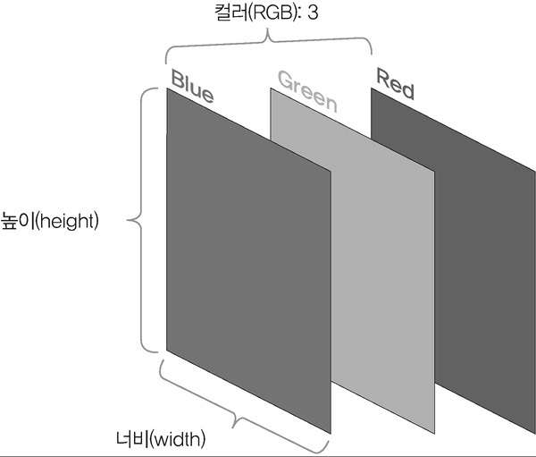
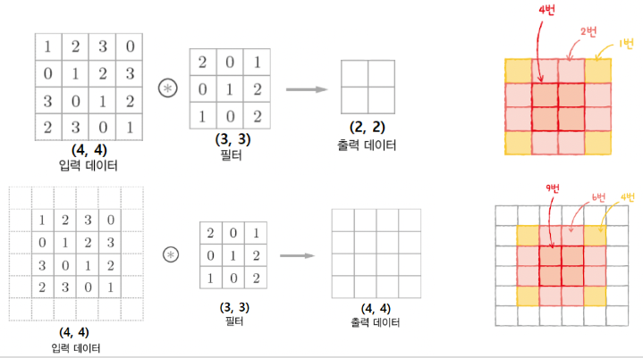

https://wikidocs.net/62306
># 합성곱 신경망 *(Convolution Neural Network)*
>`이미지`를 처리하는 인공 신경망
>
>### 이미지, 필터, 특성 맵, 스트라이드, 패딩
```angular2html
예) LeNet-5, AlexNet, VGG, GoogLeNet, ResNet, ...
```

###### 
###### 

---

## 이미지
3차원 데이터 *(높이, 너비, 채널)*
###### 
+ ### 높이 *(height)*
  세로 `픽셀` 개수

+ ### 너비 *(width)*
  가로 `픽셀` 개수

+ ### 채널 *(깊이, Channel)*
  `3`: 컬러 *(RGB)*, `1`: 흑백

## 커널 *(Kernel, 필터)*
(합성곱층)`가중치`
```
예) 3x3, 5x5
```

## 특성 맵 *(Feature Map)*
(합성곱층＆풀링층)`출력 데이터`

+ ### 합성곱층
  (`커널` + `가중합`+ `활성화 함수`) 노드 집합
  >커널 1개 *(컬러 이미지)*
  >###### 
  > 
  >커널 2개 이상 *(컬러 이미지)*
  >###### 

+ ### 풀링층 *(Pooling Layer)*
  (커널(가중치X) + 가중합 + 활성화 함수) 노드 집합
  ```
  풀링(sub-sampling): 이미지 축소
  ```
  >최대 풀링 *(Max Pooling)*
  >``` 
  >커널 내 '가장 큰 값' 선택
  >```
  >###### 
  > 
  >평균 풀링 *(Average Pooling)*
  >```
  >커널 내 '평균값' 선택
  >``` 
  >###### 
  
## 스트라이드 *(stride)*
커널 `이동 간격`
```
합성곱층: 1
풀링층: 커널 크기
```

## 패딩 *(padding)*
`입력 데이터` 주위에 가상의 원소(`0`)을 추가
###### 

+ ### 밸리드 패딩 *(Valid Padding)*
  ㅣ`입력 데이터`ㅣ ＞ ㅣ`특성 맵`ㅣ

+ ### 세임 패딩 *(Same Padding)* ★
  ㅣ`입력 데이터`ㅣ = ㅣ`특성 맵`ㅣ

