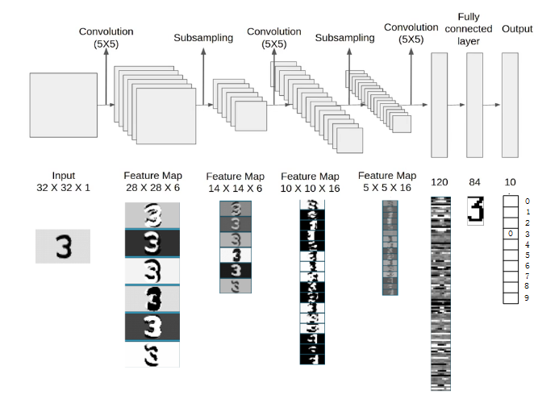

># 사전 훈련된 모델 *(Pretrained Model, Backbone)*
>대량의 `데이터셋`을 `미리` 학습한 모델
> 
>### 전이 학습 
>### LeNet, AlexNet,
>### 데이터셋
```
예) AlexNet, VGG, GoogLeNet, ResNet
```
---

## 전이 학습 *(Transfer Learning)*
사전 훈련된 모델의 `가중치`를 가져와서 학습하는 것

+ ### 특성 추출 *(Feature Extractor)*
  학습: 완전연결층
  ###### 
  ###### 

+ ### 미세 조정 *(Fine Tuning)*
  학습: `(일부)합성곱층`, 완전연결층
  ###### 
  ```angular2html
  데이터셋↑, 모델 유사성↓: 모든 층
  데이터셋↑, 모델 유사성↑: 완전연결층
  데이터셋↓, 모델 유사성↓: (일부)합성곱층, 완전연결층
  데이터셋↓, 모델 유사성↑: 완전연결층
  ```

---

## LeNet
흑백 이미지
###### 

## AlexNet
병렬 *(GPU 2대)*
```
ImageNet Large Scale Visual Recognition Challenge
: ImageNet 영상 데이터베이스 기반 화상 인식 대회 
``` 
###### 
```angular2html
예)
```

---

## 데이터셋

+ ### ImageNet
  정의
  ```
  코드
  
  예)
  ```
  
+ ### PASCAL VOC 
  정의
  ```
  코드
  
  예)
  ```
  
+ ### COCO
  정의
  ```
  코드
  
  예)
