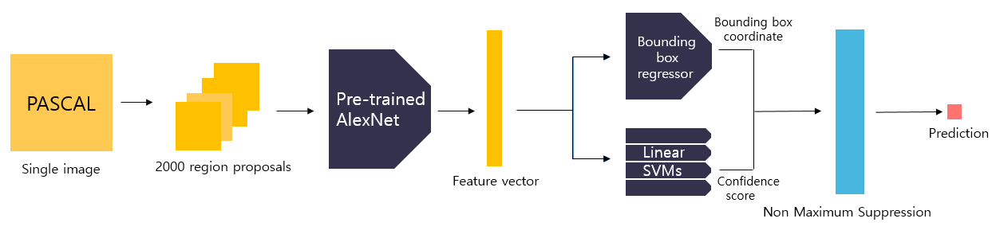

https://wikidocs.net/148633

https://herbwood.tistory.com/5

## R-CNN *(Region-based CNN)*
CNN + `Warping` *(CPU)*
###### 
```
그림 만들기

1. 이미지(PASCAL) → Selective Search 
→ Region Proposal 2000개 → Warping(227x227)

2. Region Proposal(227x227) 2000개 
→ IoU threshold(Region Proposal & GT) < 0.3 → FP ★
→ mini batch = 128(GT=32★, FP=96) → AlexNet(Fine Tuning) 
→ Feature Vector(4096) 2000개
→ SVM ★ → Confidence Score

3. Region Proposal(227x227) 2000개
→ IoU threshold(Region Proposal & GT) ≥ 0.6 → TP ★
→ AlexNet(Fine Tuning) 
→ Feature Vector(4096) 2000개
→ BBR(Bounding Box regression) ★ → Bounding Box 

4. Confidence Score, Bounding Box → NMS
```

+ ### AlexNet 미세 조정
    ```
    IoU threshold(Region Proposal & GT) ≥ 0.5 → TP
    IoU threshold(Region Proposal & GT) < 0.5 → FP
    
    mini batch = 128(TP=32, FP=96)
    ```


