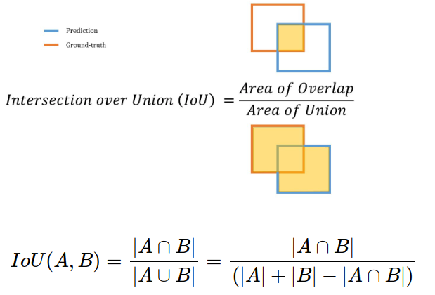
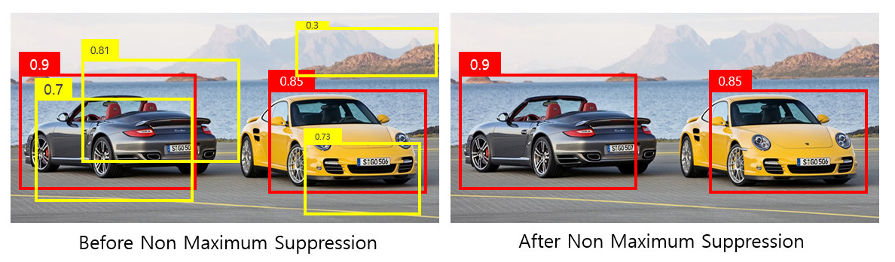

https://herbwood.tistory.com/2
># 객체 검출 *(Object Detection)*
>`분류` *(classification)* + `위치` *(localization)*
> 
>### 1-Stage, 2-Stage
>### Classification, Localization
###### 

---
## 1-Stage Detector
`Classification` + `Localization`
```angular2html
예) YOLO(You Only Look Once), SSD

ㅁ Yolo
grid cell의 box는 하나의 객체만을 예측
작은 객체를 제대로 탐지하지 못함
```

## 2-Stage Detector
`Localization1` *(RoI)* → `Classification` + `Localization2`
```
예) R-CNN, Fast R-CNN, Faster R-CNN

표 추가
ㅁ R-CNN
warping -> 정보 손실
이미지 2000개 → CNN 학습 시간↑
AlexNet, SVM, BBR 독립적 → 역전파X
```

+ ### Region Proposal
  `후보 영역` *(사각형)*
  >Selective Search *(≒군집화)*
  >###### 

+ ### RoI *(Region Of Interest)*
  `관심 영역` *(사각형)*

---

## Classification

+ ### Confidence Score *(신뢰도)*
  `Bounding Box`안에 `객체`가 있을 `확률 최대값`
  ```angular2html
  Pr(Object) * IoU
  
  Pr(Object): Bounding Box 객체 포함 여부
  ```

## Localization

+ ### Bounding Box 
  객체 `좌표` *(사각형)*
  ###### 
  ```angular2html
  예) 
  (중심_x좌표, 중심_y좌표, 가로, 세로)
  (좌상단_x좌표, 좌상단_y좌표), (우하단_x죄표, 우하단_y좌표)
  ```

+ ### BBR *(Bounding Box Regression)*
  RoI 최적화 *(≒역전파)*

+ ### IoU *(Intersection over Union)*:
  Bounding Box `중복 비율` *(GT ＆ prediction)*
  ###### 
  ```
  TP: IoU ≥ threshold
  FP: IoU < threshold
  
  https://herbwood.tistory.com/2
  ```
  >GT *(Ground Truth)*: `실제` Bounding Box *(정답)*
  >
  >prediction: `예측` Bounding Box

+ ### NMS *(Non-Maximum Suppression)*
  중복 `Bounding Box` 삭제
  ``` 
  1. Confidence Score 삭제(Confidence Score threshold 이하)
  2. Confidence Score 내림차순 정렬
  
  3. IoU(Max Confidence score ＆ 나머지 Confidence score)
  4. IoU 삭제(IoU threshold 이상)
  
  5. 3~4 반복
  ```
  ###### 
  ```
  예)
  
  Confidence Score = 0.9, 0.7, 0.81, 0.3, 0.85
  Confidence Score threshold = 0.5
  IoU treshold = 0.4
  
  1. 0.3(≤ 0.5) → 삭제
  2. 0.9, 0.85, 0.81, 0.73, 0.7 → 내림차순 정렬
  
  3~4.
  IoU(0.9 ＆ 0.85) = 0
  IoU(0.9 ＆ 0.81) = 0.44(≥ 0.4) → 삭제
  IoU(0.9 ＆ 0.73) = 0
  IoU(0.9 ＆ 0.7) = 0.67(≥ 0.4) → 삭제

      Confidence Score: 0.9, 0.85, 0.73
  
  5.
  IoU(0.85 ＆ 0.73) = 0.56(≥ 0.4) → 삭제
  
      Confidence Score: 0.9, 0.85
  ```
