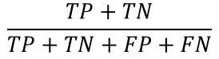
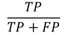
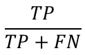

## 사례 학습
새로운 데이터와 기존 데이터의 `유사도`를 측정하여 `비교`하는 학습
```angular2html
예) K-최근접 이웃
```

## 모델 학습 
기존 데이터로 `모델`을 만든 후, 새로운 데이터를 `예측`하는 학습
```angular2html
- 하이퍼 파라미터: 모델 성능 조절 변수(수동)
- 모델 파라미터: 모델 훈련 변수(자동)
▶ 가중치: 중요도
▶ 편향: 추가 버프

- 손실 함수: 데이터에서 샘플 한 개에 대한 '손실'
  = 오차(실제값 - 예측값)

- 비용 함수: 데이터에서 모든 샘플에 대한 '손실'의 합
  = 오차(실제값 - 예측값) 합
```
+ ### 모델 훈련
  `비용 함수`를 `최소화`하는 `모델 파라미터`를 찾는 것

+ ### 모델 성능 조절
  ### 지도 학습
  >K-겹 교차 검증(K-fold Cross Validation)
  >```
  >중복을 허용하지 않고 훈련 데이터를 임의의 K개로 분할
  >
  >훈련 데이터: K-1개 + 검증 데이터: 1개
  >→ 모델 학습 → 모델 평가
  >→ K번 반복 ★
  >→ 모델 평가(평균)
  >```
  >
  >그리드 서치
  >```
  >K-겹 교차 검증 + 하이퍼 파라미터 최적화
  >
  >- 매개변수 범위 '직접' 설정
  >```
  >
  >랜덤 서치
  >```
  >K-겹 교차 검증 + 하이퍼 파라미터 최적화
  >
  >- 매개변수 범위 '랜덤' 설정
  >```

+ ### 모델 평가
  ```angular2html
  - 과대적합
    ▶ 훈련 데이터 정확도 >> 테스트 데이터 정확도
  
            ↓↓↓↓↓   규제(기울기 감소)↑, 모델 파라미터 개수↓
  
            ↑↑↑↑↑   규제(기울기 증가)↓, 모델 파라미터 개수↑, 특성 공학 
  
  - 과소적합
    ▶ 훈련 데이터 정확도 < 테스트 데이터 정확도
    ▶ 훈련,테스트 데이터 정확도↓↓
  ```
  
  ### 분류
  >오차 행렬 *(Confusion matrix)*
  >###### 
  >```
  >TP(True Positive): 실제 참을 참으로 예측
  >FN(False Negative): 실제 참을 거짓으로 예측
  >FP(False Positive): 실제 거짓을 참으로 예측
  >TN(True Negative): 실제 거짓을 거짓으로 예측
  >```
  >
  >>정확도: 정답 / 전체
  >>###### 
  >> 
  >>정밀도 *(Precision)*: 참이라고 예측할 때, 실제 참인 비율 ★
  >>###### 
  >> 
  >>재현율 *(recall, 탐지율)*: 실제 참일 때, 참이라고 예측한 비율 ★
  >>###### 
  > 
  >ROC 곡선 *(Receiver Operation Characteristic Curve)*
  >``` 
  >x축: FPR(False Positive Rate, 1-특이도)
  >y축: 재현율
  >임계값(threshold)
  >
  >AUC(Area Under Curve): ROC 곡선 면적
  >  범위: 0 ~ 1
  >  AUC↑ → 성능↑
  >```
  >
  >정밀도＆재현율 곡선 *(Precision-Recall curve)*
  >```
  >x축: 재현율
  >y축: 정밀도
  >
  >AP(average precision): PR 곡선 면적
  >mAP(mean Average Precision): 전체 클래스 평균 AP
  >
  >예) 객체 검출
  >``` 

  ### 회귀
  >평균 제곱근 오차 *(RMSE)*
  >```
  >root( 1/n x ∑오차² )
  >``` 
  >평균 절대 오차 *(MAE)*
  >```
  >1/n x ( ∑ㅣ오차ㅣ )
  >```
  