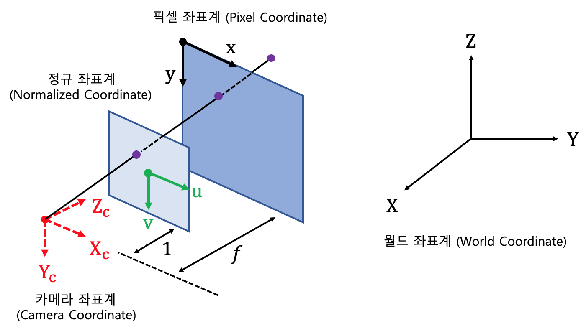
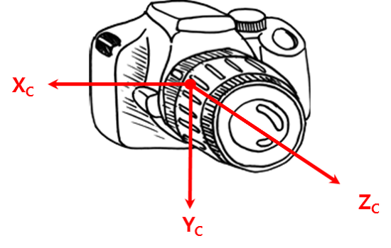

https://gaussian37.github.io/autodrive-lidar-intro/
># 자율주행 *(ApolloAuto)*
>
>### Perception, Localization, Control
---

## perception *(인지)*
차량 `주변 환경` *(센서)*
###### 
```
센서 퓨전(Sensor Fusion): 센서 융합

라이다 ↔ 카메라
https://darkpgmr.tistory.com/190
```

+ ### 카메라
  ###### 
  ```
  Xc: right(+), left(-)
  Yc: down(+), up(-)
  Zc: front
  ```

+ ### 라이다 *(Lidar, Light Detection and Ranging)*
  직진성 강한 고출력 `레이저` *(빛)*
  ```
  (x, y, z, r)
  
  중심: (0, 0, 0)
  x: front    y: left(+), right(-)
  z: height    r(eflectance): 반사도
  
  예) AT128(hesaitech 회사), RS-Bpearl(RoboSense 회사), velodyne
  ```
  >Recognition: 객체 검출
+ ### 레이더 *(Radar, Radio Detection and Ranging)*
  `전자기파`

## Localization *(측위)*
  차량 `현재 위치` *(인지 + HD map)*
  
+ ### HD Map *(High Definition Map, 고정밀지도)*
  정밀도 높은 3D 지도

## control *(제어)*
차량 제어
```commandline
예) 브레이크, 가속, 스티어링, ...
```